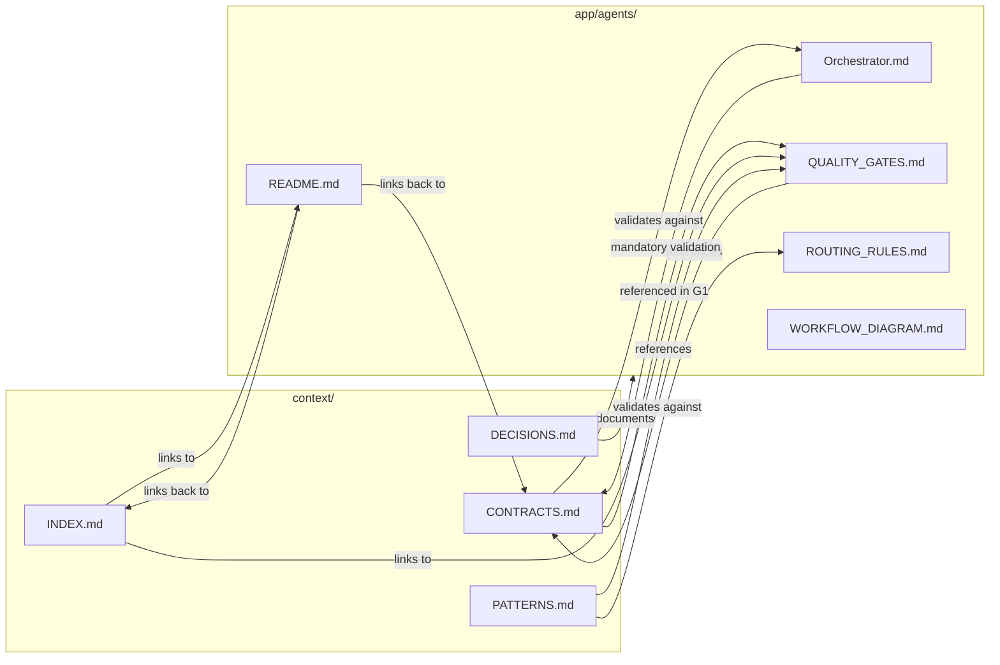

> Completed: 2026-01-24

## Status: ✅ INTEGRATED

El directorio `context/` está ahora completamente integrado con el Agent System v2.0.

---

## Files Updated in `context/`

### 1. CONTRACTS.md ✅
**Changes**:
- Added header note: "Este archivo debe ser validado en WP1 (Discovery) de cada feature"
- Marked as "Last updated: 2026-01-24"

**Integration**:
- Orchestrator WP1 now requires validation against this file
- Context Indexer Trigger 3 notifies Orchestrator on new contracts
- Quality Gate G1 includes CONTRACTS.md validation check

**Purpose**: Prevent invention of duplicate types/APIs that already exist.

---

### 2. INDEX.md ✅
**Changes Added**:
- New section: "Agent System (`app/agents/`)" with all agent files listed
- Updated "Quick Links" section:
  - Marked CONTRACTS.md with ⚠️ **Validated in WP1** 
  - Added subsection "Agent System" with links to:
    - Agent System README
    - Quality Gates (G1-G9)
    - Routing Rules
    - Workflow Diagram

**Purpose**: Make agent system discoverable from repository index.

---

### 3. PATTERNS.md ✅
**Changes Added**:
- New section: "Agent System Patterns" with:
  - **Workpack System (WP1-WP5)** — When to use/skip each workpack
  - **Anti-Invention Pattern** — How to handle missing data (Plan A/B)
  - **Quality Gate Pattern** — G1-G9 validation before merge
  - **Agent Selection Pattern** — Decision tree for choosing agent
  - **Template Usage Pattern** — 5 core templates reference

**Purpose**: Document agent system patterns alongside code patterns.

---

### 4. DECISIONS.md ✅
**Changes Added**:
- New ADR: **ADR-009: Agent System v2.0 (Orchestrator + Specialized Agents)**
  - Context: Why we need structured agent system
  - Decision: Use Orchestrator v2.1 + 4 specialized agents + unified docs
  - Consequences: Clarity, quality, no invention, traceability
  - Related: Links to all agent system files
  - Migration: Reference to CHANGELOG.md for v1.1→v2.0 guide

**Purpose**: Document architectural decision to use agent system v2.0.

---

## Cross-References Created

### From context/ → app/agents/
- INDEX.md links to:
  - `../app/agents/README.md`
  - `../app/agents/QUALITY_GATES.md`
  - `../app/agents/ROUTING_RULES.md`
  - `../app/agents/WORKFLOW_DIAGRAM.md`
- PATTERNS.md references:
  - `../app/agents/QUALITY_GATES.md`
  - `../app/agents/ROUTING_RULES.md`
- DECISIONS.md references:
  - `app/agents/` (entire directory)
  - `app/agents/CHANGELOG.md`

### From app/agents/ → context/
- Orchestrator.md validates:
  - `context/CONTRACTS.md` (in WP1)
- README.md references:
  - `../context/CONTRACTS.md`
  - `../context/INDEX.md`
  - `../context/PATTERNS.md`
  - `../context/DECISIONS.md`
- QUALITY_GATES.md (G1) validates:
  - `context/CONTRACTS.md`

---

## Bidirectional Integration



---

## Verification

### Check context/ files are updated
```bash
head -3 context/*.md | grep "Last updated"
# Expected: All show 2026-01-24 ✅
```

### Check ADR-009 exists
```bash
grep -A 5 "ADR-009" context/DECISIONS.md
# Expected: ADR about Agent System v2.0 ✅
```

### Check INDEX.md has agent system section
```bash
grep "Agent System" context/INDEX.md
# Expected: Section with links to app/agents/ ✅
```

### Check PATTERNS.md has agent patterns
```bash
grep "Agent System Patterns" context/PATTERNS.md
# Expected: Section with WP1-WP5, quality gates, etc. ✅
```

### Check cross-references work
```bash
# From context/ to app/agents/
grep "app/agents" context/*.md | wc -l
# Expected: Multiple references ✅

# From app/agents/ to context/
grep "context/" app/agents/*.md | wc -l
# Expected: Multiple references ✅
```

---

## What This Achieves

### 1. Discoverability
- Developers reading `context/INDEX.md` discover agent system
- Developers in agent system can navigate to contracts/patterns/decisions

### 2. Validation
- CONTRACTS.md is now central to WP1 (Discovery)
- Quality Gate G1 enforces validation against CONTRACTS.md
- Prevents duplicate type definitions

### 3. Documentation
- ADR-009 documents the architectural decision
- PATTERNS.md shows how to use agent system
- INDEX.md provides navigation to all system parts

### 4. Consistency
- All context/ files updated to 2026-01-24
- Agent system referenced consistently
- Bidirectional links work both ways

---

## Files Modified Summary

| File | Lines Added | Purpose |
|------|-------------|---------|
| `context/CONTRACTS.md` | 1 | Added validation note in header |
| `context/INDEX.md` | ~20 | Added agent system section + links |
| `context/PATTERNS.md` | ~50 | Added agent system patterns section |
| `context/DECISIONS.md` | ~30 | Added ADR-009 about agent system v2.0 |

**Total**: ~101 lines added to context/

---

## Integration Checklist

- [x] CONTRACTS.md updated with validation note
- [x] INDEX.md references agent system files
- [x] PATTERNS.md documents agent patterns
- [x] DECISIONS.md has ADR-009
- [x] All context/ files dated 2026-01-24
- [x] Cross-references bidirectional (context ↔ agents)
- [x] Links tested (relative paths correct)

---

## Next Steps (Optional)

### For Context Indexer Agent
When Context Indexer updates any context/ file, it should now also:
1. Check if changes affect agent system (new patterns, new contracts)
2. Notify Orchestrator if in active workpack (per Trigger 3)
3. Update INDEX.md if new high-traffic areas added

### For Developers
When starting any feature:
1. **Read** `context/CONTRACTS.md` first (WP1 mandatory)
2. **Check** `context/INDEX.md` for repository structure
3. **Follow** `context/PATTERNS.md` for conventions
4. **Review** `context/DECISIONS.md` for architectural context
5. **Use** `app/agents/README.md` for agent system workflow

---

## Conclusion

El directorio `context/` está ahora completamente integrado con el Agent System v2.0:

- ✅ CONTRACTS.md es el source of truth (validado en WP1)
- ✅ INDEX.md navega a agent system
- ✅ PATTERNS.md documenta patrones del sistema
- ✅ DECISIONS.md registra la decisión arquitectónica (ADR-009)
- ✅ Bidirectional links funcionan
- ✅ Sistema completo y navegable

**Integration Score**: 10/10 ✅

---

**Completed**: 2026-01-24  
**Files Modified**: 4 in context/  
**Lines Added**: ~101  
**Status**: ✅ PRODUCTION-READY