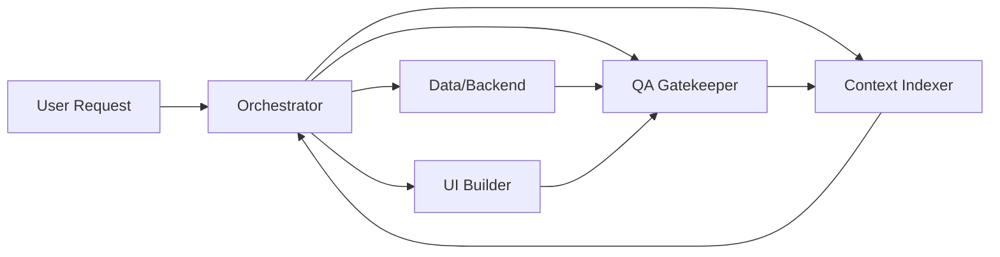

> Last updated: 2026-01-24

Sistema de agentes especializados para desarrollo con vibe-coding sin caos.

---

## Quick Start

1. Lee [Orchestrator](./Orchestrator.md) para entender el flujo WP1-WP5
2. Consulta [ROUTING_RULES](./ROUTING_RULES.md) para saber cuándo usar cada agente
3. Revisa [QUALITY_GATES](./QUALITY_GATES.md) para criterios de calidad
4. Visualiza [WORKFLOW_DIAGRAM](./WORKFLOW_DIAGRAM.md) para el flujo completo

---

## Agents

| Agent | Version | Purpose | Primary Use |
|-------|---------|---------|-------------|
| [Orchestrator](./Orchestrator.md) | v2.1 | Coordination, workpacks | Always (WP1-WP5) |
| [Data/Backend](./data-backend.md) | v1.1 | API, DB, RLS | WP2 (Backend) |
| [UI Builder](./ui-builder.md) | v1.1 | Components, UX | WP3 (Frontend) |
| [QA Gatekeeper](./qa-gatekeeper.md) | v1.1 | Testing, gates | All WPs (validation) |
| [Context Indexer](./context-indexer.md) | v1.0 | Docs, patterns | As needed |

### Agent Responsibilities



---

## System Documents

### Core Documentation
- [QUALITY_GATES.md](./QUALITY_GATES.md) - Unified gate definitions (G1-G9)
- [ROUTING_RULES.md](./ROUTING_RULES.md) - Escalation flowchart
- [WORKFLOW_DIAGRAM.md](./WORKFLOW_DIAGRAM.md) - WP1-WP5 visual flow
- [CHANGELOG.md](./CHANGELOG.md) - Version history

### Templates
- [templates/](./templates/) - 5 core templates
  - workpack.md - Macro-task definition
  - agent-prompt.md - Agent-specific prompts
  - qa-gate.md - Quality validation
  - merge-plan.md - Merge documentation
  - review-request.md - Correction requests

### Context Files
- [../context/CONTRACTS.md](../context/CONTRACTS.md) - Type contracts (must validate in WP1)
- [../context/INDEX.md](../context/INDEX.md) - Repository map (if exists)
- [../context/PATTERNS.md](../context/PATTERNS.md) - Code patterns (if exists)
- [../context/DECISIONS.md](../context/DECISIONS.md) - ADRs (if exists)

---

## Workpack System (WP1-WP5)

Every feature follows this flow:

### WP1: Discovery (MANDATORY)
**Duration**: 15-30 min  
**Agent**: Orchestrator + Context Indexer  
**Purpose**: Read code, validate contracts, define spec

**Activities**:
- Read existing files
- **Verify CONTRACTS.md** for existing types
- Detect assumptions, propose Plan A/B
- Define input/output contracts

**Output**: Spec document, not code

---

### WP2: Backend (Optional - skip if UI-only)
**Duration**: 30-60 min  
**Agent**: Data/Backend + QA (security)  
**Purpose**: API routes, DB, RLS

**Activities**:
- Create API endpoints
- Add Zod validation
- Configure RLS policies
- Add indexes

**Output**: API code + migrations + verification

---

### WP3: Frontend (Optional - skip if API-only)
**Duration**: 30-60 min  
**Agent**: UI Builder + QA (UX)  
**Purpose**: Components, UX states

**Activities**:
- Create React components
- Add states (loading/empty/error)
- Connect to API (if WP2 exists)
- Responsive + dark mode + a11y

**Output**: Component code + verification

---

### WP4: Testing (Required - skip only for hotfixes)
**Duration**: 30-45 min  
**Agent**: QA Gatekeeper  
**Purpose**: Unit + e2e tests, edge cases

**Activities**:
- Write unit tests
- Write e2e tests (Playwright)
- Test edge cases
- Create smoke test checklist

**Output**: Test suite + coverage report

---

### WP5: Polish (Optional - skip for hotfixes)
**Duration**: 15-30 min  
**Agent**: Orchestrator + Context Indexer  
**Purpose**: Docs, optimization, final QA

**Activities**:
- Update documentation
- Optimize performance
- Cleanup code
- Final QA gate validation

**Output**: Deploy-ready feature

---

## Quality Gates

All workpacks validate against applicable gates from [QUALITY_GATES.md](./QUALITY_GATES.md):

### Universal Gates (G1-G5)
- **G1: Contract Compliance** - Types, Zod schemas, CONTRACTS.md validation
- **G2: Security & Privacy** - Auth, RLS, rate limit, no PII
- **G3: UX States & Edge Cases** - Loading/empty/error handled
- **G4: Code Quality** - Tailwind, dark mode, TypeScript strict
- **G5: Verification & Testing** - Smoke tests, rollback plan

### Specialized Gates (G6-G9)
- **G6: Mobile Sheet UX** - Scroll + focus (UI/QA)
- **G7: Performance** - Query optimization, no layout shift (Backend/UI)
- **G8: Freshness** - Documentation up-to-date (Context)
- **G9: Actionable Context** - Links + examples (Context)

**See**: [QUALITY_GATES.md](./QUALITY_GATES.md) for complete matrix.

---

## Anti-Invention System

If data is missing:

1. **Search existing code/schemas** (`config/supabase/`, `types/`, `lib/`)
2. **Propose Plan A / Plan B**:
   - Plan A (conservative): Use existing or create new without assumptions
   - Plan B (optimal): Assume X and mark explicitly
3. **Choose Plan A by default** (safer)
4. **Mark assumptions explicitly** in output

### Example: Missing Table Schema

User asks: "Add favorites feature"

**Agent detects**: No `favorites` table in schema

**Response**:
```markdown
## Assumptions
- [ ] Asumo que NO existe tabla `favorites` → crearemos schema en WP2

**Plan A** (conservative):
- Create new table `favorites` with minimal schema (user_id, unit_id, created_at)

**Plan B** (optimal, requires confirmation):
- Use existing `bookmarks` table and rename to `favorites` (if it exists)

**Selected**: Plan A (safer - no risk of breaking existing bookmarks)
```

**Never invent** schemas, APIs, or props without validation.

---

## FAQ

### Q: Which agent do I use for my task?

**A**: See [ROUTING_RULES.md](./ROUTING_RULES.md) decision tree. Quick guide:
- API/DB work → Data/Backend
- UI/Components → UI Builder
- Testing → QA Gatekeeper
- Documentation → Context Indexer
- Coordination/planning → Orchestrator

---

### Q: Can I skip workpacks?

**A**: Yes, but WP1 is always mandatory.
- Skip WP2: UI-only features (no backend)
- Skip WP3: API-only features (no UI)
- Skip WP5: Hotfixes (deploy ASAP)

See [WORKFLOW_DIAGRAM.md](./WORKFLOW_DIAGRAM.md) for skip rules.

---

### Q: What if a QA gate fails?

**A**: 
1. Agent creates [review-request](./templates/review-request.md) with specific issues
2. Agent fixes issues
3. Agent re-submits for QA
4. Loop until all required gates PASS

---

### Q: Where are types/contracts defined?

**A**: [../context/CONTRACTS.md](../context/CONTRACTS.md)

**IMPORTANT**: Always validate against CONTRACTS.md in WP1 (Discovery) before creating new types. This prevents duplication and ensures consistency.

---

### Q: How long does a typical feature take?

**A**: Depends on complexity:
- Simple (UI or API only): ~1-2 hours
- Standard (Backend + Frontend): ~3 hours
- Complex (Multiple tables, complex UI): ~4 hours
- Hotfix: ~45 minutes

See [WORKFLOW_DIAGRAM.md](./WORKFLOW_DIAGRAM.md) for time estimates.

---

### Q: What if I find inconsistencies between agents?

**A**: 
1. Check [QUALITY_GATES.md](./QUALITY_GATES.md) for official definitions
2. Check [ROUTING_RULES.md](./ROUTING_RULES.md) for escalation rules
3. If still unclear, escalate to Orchestrator
4. File issue for documentation improvement

---

### Q: Can I modify an agent definition?

**A**: Yes, but follow this process:
1. Propose change with justification
2. Update agent documentation
3. Update CHANGELOG.md with version bump
4. Update QUALITY_GATES.md if gates change
5. Test change with 1 complete feature (WP1-WP5)

---

## Getting Started Examples

### Example 1: Create a Simple API Endpoint

**Task**: "Create `/api/units/search` endpoint"

**Flow**:
```
User → Orchestrator (reads task)
     → WP1: Discovery (validates CONTRACTS.md, defines API contract)
     → WP2: Backend (Data/Backend implements endpoint + RLS)
     → WP4: Testing (QA writes tests)
     → WP5: Polish (Context updates CONTRACTS.md)
```

**Duration**: ~2 hours

**Agents Used**: Orchestrator, Data/Backend, QA Gatekeeper, Context Indexer

---

### Example 2: Add UI Component

**Task**: "Add loading skeleton to PropertyCard"

**Flow**:
```
User → Orchestrator (reads task)
     → WP1: Discovery (identifies component, defines states)
     → WP3: Frontend (UI Builder implements skeleton) [Skip WP2]
     → WP4: Testing (QA tests loading state)
     → WP5: Polish (documents pattern)
```

**Duration**: ~1.5 hours

**Agents Used**: Orchestrator, UI Builder, QA Gatekeeper

---

### Example 3: Fix Critical Bug (Hotfix)

**Task**: "Fix crash when images array is empty"

**Flow**:
```
User → Orchestrator (identifies root cause)
     → WP1: Discovery (finds crash in PropertyGallery.tsx)
     → WP3: Frontend (UI Builder adds guard) [Skip WP2]
     → WP4: Testing (QA verifies fix) [Skip WP5 - deploy ASAP]
```

**Duration**: ~45 minutes

**Agents Used**: Orchestrator, UI Builder, QA Gatekeeper

---

## Architecture Overview

### System Design Principles

1. **Separation of Concerns**: Each agent has single, clear responsibility
2. **Contract-First**: All interactions use explicit contracts (types, schemas)
3. **Quality-Gated**: Every workpack validates before merge (G1-G9)
4. **Anti-Invention**: Never guess - validate or propose alternatives
5. **Iterative**: 1 workpack per iteration, minimal scope
6. **Traceable**: Every decision documented in CHANGELOG or DECISIONS.md

### Key Concepts

**Workpack**: Unit of work (1 iteration, 1-3 agents, ≤5 files)

**Quality Gate**: Binary pass/fail checkpoint (G1-G9)

**Agent Handoff**: Structured transfer of context/contracts between agents

**Discovery Phase (WP1)**: Mandatory validation against existing code/contracts

**Merge Plan**: Documentation of changes ready for integration

---

## Monitoring & Maintenance

### Health Checks

Run these periodically to ensure system health:

```bash
# 1. Check all agents have versions
rg "^# .* v\d+\.\d+" app/agents/*.md

# 2. Check for broken links in context
rg "\[.*\]\(.*\.md\)" context/*.md

# 3. Verify CONTRACTS.md is recent
head -5 context/CONTRACTS.md

# 4. Check templates are up to date
ls -la app/agents/templates/
```

### Update Cadence

- **Daily**: Context Indexer refresh if ≥5 commits in critical areas
- **Per Feature**: Update CONTRACTS.md after WP2/WP3 if new types added
- **Weekly**: Review CHANGELOG for drift from actual usage
- **Monthly**: Full audit of agent system integration

---

## Contributing

### Reporting Issues

If you find problems with the agent system:

1. Check [CHANGELOG.md](./CHANGELOG.md) - issue may be known
2. Check [QUALITY_GATES.md](./QUALITY_GATES.md) - gate definitions may clarify
3. File issue with template:

```markdown
**Agent**: [which agent has the issue]
**Issue**: [description]
**Impact**: High/Med/Low
**Proposed Fix**: [optional]
```

### Proposing Improvements

1. Create ADR (see Context Indexer format)
2. Update affected agent documentation
3. Update CHANGELOG.md under "Unreleased"
4. Test with 1 complete feature (WP1-WP5)
5. Submit for review

---

## Resources

### Stack
- Next.js 14 (App Router)
- React 18
- TypeScript strict mode
- TailwindCSS
- Zod (validation)
- Supabase (database)

### Project Rules
- [.cursor/rules/00-core.mdc](../.cursor/rules/00-core.mdc) - Core project rules
- [.cursor/rules/10-api.mdc](../.cursor/rules/10-api.mdc) - API rules
- [.cursor/rules/20-components.mdc](../.cursor/rules/20-components.mdc) - Component rules
- [.cursor/rules/30-pages.mdc](../.cursor/rules/30-pages.mdc) - Pages rules

---

## Changelog

See [CHANGELOG.md](./CHANGELOG.md) for complete version history.

**Current Version**: 2.0.0 (2026-01-24)

**Key Changes in v2.0**:
- Unified Quality Gates (G1-G9)
- Consolidated Orchestrator (v2.1 official)
- CONTRACTS.md validation mandatory in WP1
- Routing rules centralized
- Workflow diagrams added

---

## License

Internal project - all rights reserved.

---

## Contact

For questions or support with the agent system:
- Check this README first
- Review [ROUTING_RULES.md](./ROUTING_RULES.md) for agent selection
- Escalate to Orchestrator if unclear

---

**Maintained by**: Orchestrator + Context Indexer  
**Status**: Active Development  
**Version**: 2.0.0