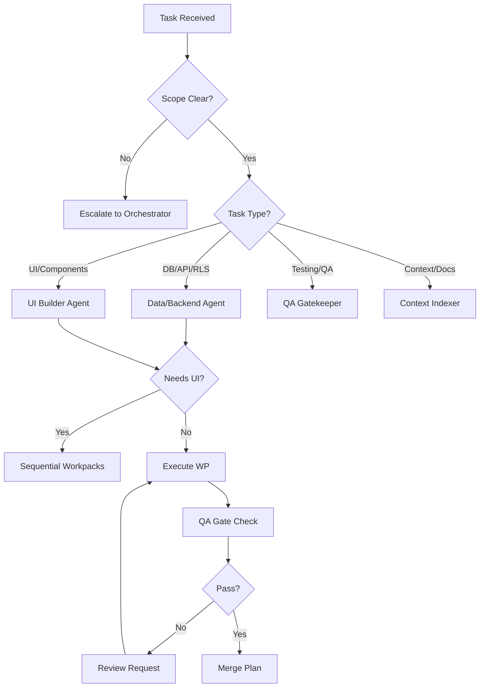

> Last updated: 2026-01-24

## Purpose

Este documento define las reglas de routing (escalación) entre agentes del sistema. Especifica cuándo usar cada agente, cómo escalar problemas al Orchestrator, y cómo manejar handoffs entre agentes.

---

## Decision Tree



---

## Escalation Triggers (to Orchestrator)

Escalate IMMEDIATELY if any of these conditions:

### 1. Scope Unclear or Too Broad
- Pedido afecta >3 archivos sin scope definido
- No está claro qué workpack aplica (WP2 vs WP3)
- Feature requiere múltiples workpacks pero no hay secuencia definida

**Example**: "Mejora la búsqueda" (muy vago) → Orchestrator define scope específico

---

### 2. Multiple Agents Required
- Tarea requiere >1 agente sin coordinación clara
- Backend + Frontend deben trabajar en paralelo
- Handoff entre agentes no está definido

**Example**: "Agregar login con Google" → Backend (API auth) + Frontend (UI button) + QA (tests)

---

### 3. Architecture Decision Needed
- Decisión afecta >1 área del sistema
- Trade-off significativo (performance vs simplicidad)
- Patrón nuevo que puede sentar precedente

**Example**: "¿Usar Context API o Zustand para auth state?" → Orchestrator decide + documenta ADR

---

### 4. Conflicting Patterns Detected
- Código existente usa 2+ patrones incompatibles
- No está claro cuál patrón seguir
- Refactor necesario para consistencia

**Example**: Algunos componentes usan SearchFormContext, otros useState local → Orchestrator unifica

---

### 5. Missing Critical Information
- No existe schema de tabla necesaria
- No hay contrato de API requerida
- Tipo/interface faltante en CONTRACTS.md

**Example**: "Agregar favoritos" pero no existe tabla `favorites` ni está en CONTRACTS.md → Orchestrator define schema

---

## Agent Selection Rules

### When to Use: Data/Backend Agent

**Tarea involucra**:
- API routes (`app/api/*`)
- Database queries/migrations
- RLS policies (Supabase)
- Zod validation (server-side)
- Rate limiting
- Performance optimization (queries, indexes)

**Examples**:
- Crear endpoint `/api/visits`
- Agregar RLS a tabla `bookings`
- Optimizar query lento (agregar índice)
- Migración de schema (nueva columna)

**Do NOT use for**:
- ❌ UI components (use UI Builder)
- ❌ Client-side validation (use UI Builder)
- ❌ Tests (use QA Gatekeeper)

---

### When to Use: UI Builder Agent

**Tarea involucra**:
- React components
- Forms (client-side)
- UX states (loading/empty/error)
- Mobile-first layouts
- Accessibility (focus, ARIA, keyboard)
- Tailwind styling

**Examples**:
- Crear componente `PropertyCard`
- Implementar modal de filtros
- Agregar skeleton loading
- Fix mobile responsive issue
- Mejorar a11y de formulario

**Do NOT use for**:
- ❌ API endpoints (use Data/Backend)
- ❌ Database queries (use Data/Backend)
- ❌ Writing tests (use QA Gatekeeper)

---

### When to Use: QA Gatekeeper Agent

**Tarea involucra**:
- Writing tests (unit/e2e)
- Risk assessment
- Quality gate validation
- Edge case identification
- Smoke test design
- Bug verification

**Examples**:
- Escribir tests e2e con Playwright
- Validar que feature cumple G1-G5
- Identificar edge cases (data vacía, offline)
- Crear smoke test checklist
- Verificar fix de bug

**Do NOT use for**:
- ❌ Implementar features (use Builder/Backend)
- ❌ Escribir código de producción
- ❌ Documentar patrones (use Context Indexer)

---

### When to Use: Context Indexer Agent

**Tarea involucra**:
- Updating CONTRACTS.md
- Detecting patterns
- Documenting ADRs
- Creating context packs
- Indexing new areas

**Examples**:
- Agregar nuevo tipo a CONTRACTS.md
- Detectar patrón repetido en 3+ archivos
- Crear ADR para decisión arquitectónica
- Generar context pack para feature X
- Actualizar INDEX.md con nuevo área

**Do NOT use for**:
- ❌ Implementar código
- ❌ Escribir tests
- ❌ Tomar decisiones arquitectónicas (use Orchestrator)

---

## Cross-Agent Handoffs

### Backend → Frontend Handoff

**Backend outputs**:
```markdown
## Backend Deliverables for Frontend

**Endpoint**: `POST /api/visits`

**Request Contract**:
```typescript
{
  unitId: string;
  date: string; // ISO 8601
  email: string;
  phone: string;
}
```

**Response Contract**:
```typescript
// 201 Created
{
  data: {
    id: string;
    status: "pending";
  };
}

// 400 Bad Request
{
  code: "VALIDATION_ERROR";
  message: string;
  details?: Record<string, string[]>;
}
```

**Error Codes**:
- 400: Validation error
- 409: Time slot not available
- 429: Rate limit exceeded
- 500: Server error
```

**Frontend inputs**:
- Endpoint URL + contract
- Loading/error states to implement
- Validation rules (client-side mirror)

**Verification**:
```bash
# Frontend puede testar endpoint:
curl -X POST http://localhost:3000/api/visits \
  -d '{"unitId":"123","date":"2026-01-25T10:00:00Z","email":"test@example.com","phone":"+56912345678"}' \
  -H "Content-Type: application/json"
```

---

### Frontend → QA Handoff

**Frontend outputs**:
```markdown
## Frontend Deliverables for QA

**Components Implemented**:
- `VisitScheduler` (components/flow/VisitScheduler.tsx)
- `DatePicker` (components/ui/DatePicker.tsx)

**User Flows**:
1. User selects unit → opens scheduler
2. User picks date/time → fills contact info
3. User submits → sees confirmation

**States Implemented**:
- Loading: skeleton while fetching slots
- Empty: "No slots available" message
- Error: "Failed to book" + retry button
- Success: "Visit booked!" confirmation

**Edge Cases to Test**:
- No available slots
- Network error during submit
- Validation errors (invalid email/phone)
```

**QA inputs**:
- Smoke test scenarios
- Edge cases to validate
- Expected behaviors per state

**Verification**:
```markdown
## QA Smoke Tests

1. **Happy Path**:
   - Open /property/123
   - Click "Schedule Visit"
   - Pick date → fill form → submit
   - Expected: Confirmation + visit ID

2. **Error Path**:
   - Disconnect network → try submit
   - Expected: Error message + retry button
```

---

### Any Agent → Context Indexer Handoff

**Trigger**: New types/patterns/APIs added

**Requesting Agent outputs**:
```markdown
## Context Update Request

**New Contract**:
- Type: API endpoint
- Location: `app/api/visits/route.ts`
- Contract: [paste types/schemas]

**Pattern Detected** (optional):
- Pattern: "Modal fullscreen en mobile, centered en desktop"
- Frequency: Usado en 3+ componentes
- Recommendation: Documentar en PATTERNS.md
```

**Context Indexer actions**:
1. Update CONTRACTS.md with new types
2. Update PATTERNS.md if pattern repeated ≥3 times
3. Create ADR if architecture changed
4. Update INDEX.md if new area added

---

## Routing Decision Matrix

| Scenario | Primary Agent | Supporting | Orchestrator? |
|----------|--------------|------------|---------------|
| Crear endpoint nuevo | Data/Backend | - | No |
| Crear componente UI | UI Builder | - | No |
| Crear endpoint + UI que lo usa | - | - | **Yes** (coordina WP2→WP3) |
| Optimizar query lenta | Data/Backend | QA (verify) | No |
| Fix bug en componente | UI Builder | QA (verify) | No |
| Refactor patrón usado en 10+ archivos | - | - | **Yes** (decide approach) |
| Agregar tests e2e | QA Gatekeeper | - | No |
| Documentar patrón nuevo | Context Indexer | - | No |
| Decisión: Context vs Zustand | - | - | **Yes** (ADR + impl plan) |
| Actualizar CONTRACTS.md | Context Indexer | - | No |

---

## Escalation Format

Cuando escalas al Orchestrator, usa este formato:

```markdown
🚨 ROUTING ESCALATION

**From Agent**: [tu rol]
**Trigger**: [#1-5 de arriba]

**Context**:
[2-3 líneas explicando situación]

**Blocker**:
[Qué no puedes decidir/implementar sin Orchestrator]

**Options Considered**:
- Plan A: [approach conservador]
- Plan B: [approach óptimo]

**Recommendation**: [cual prefieres y por qué]

**Impact if not resolved**:
[Qué se bloquea]
```

**Example**:
```markdown
🚨 ROUTING ESCALATION

**From Agent**: UI Builder
**Trigger**: #3 (Architecture decision needed)

**Context**:
Feature "favoritos" requiere estado global. Código actual tiene:
- SearchFormContext (para filtros)
- useState local (en algunos componentes)
No hay patrón consistente para estado global cross-page.

**Blocker**:
No puedo decidir entre Context API (consistente con Search) vs Zustand (más escalable) sin sentar precedente para futuras features.

**Options Considered**:
- Plan A: Context API (consistente pero no escala >5 contexts)
- Plan B: Zustand (escalable pero introduce nueva dependencia)

**Recommendation**: Plan B + migrar SearchFormContext en WP5 futuro

**Impact if not resolved**:
Feature "favoritos" bloqueada. Deuda técnica crece (3er patrón de estado).
```

---

## FAQ

### Q: ¿Qué hago si no estoy seguro qué agente usar?

**A**: Escala al Orchestrator con trigger #1 (scope unclear). Mejor preguntar que inventar.

---

### Q: ¿Puedo coordinar directamente con otro agente sin Orchestrator?

**A**: Solo para handoffs simples (Backend→Frontend con contrato claro). Si hay ambigüedad, escala.

---

### Q: ¿Qué pasa si mi tarea toca 2 dominios (ej: UI + DB)?

**A**: Escala con trigger #2 (multiple agents). Orchestrator creará workpacks secuenciales (WP2 backend, WP3 frontend).

---

### Q: ¿Cuándo debo actualizar CONTRACTS.md?

**A**: Después de WP2 (backend) o WP3 (frontend) si agregaste tipos/APIs nuevos. Handoff a Context Indexer.

---

### Q: ¿Puedo implementar sin WP1 (Discovery) si es "obvio"?

**A**: **NO**. WP1 es obligatorio. Valida contra CONTRACTS.md, detecta assumptions, define contratos. No hay excepciones.

---

## Changelog

### v1.0 (2026-01-24)
- Initial routing rules documentation
- Decision tree diagram
- 5 escalation triggers
- Agent selection rules (4 agents)
- Cross-agent handoff protocols
- Routing decision matrix
- Escalation format template