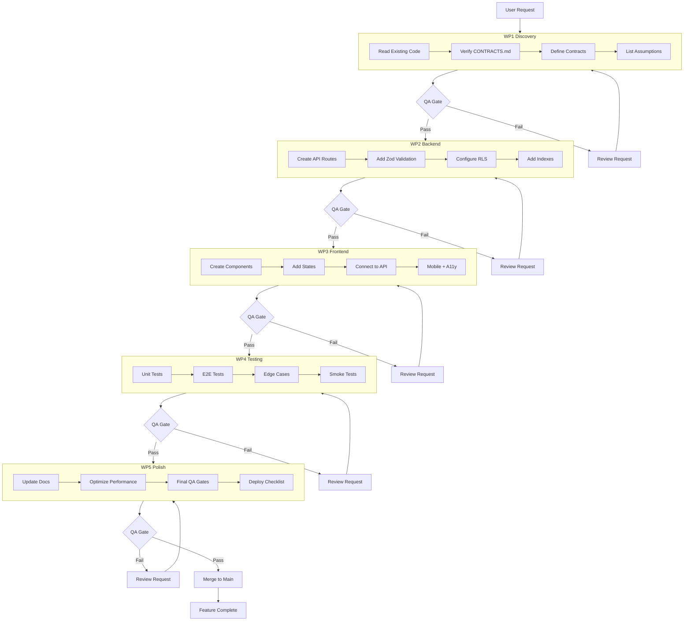
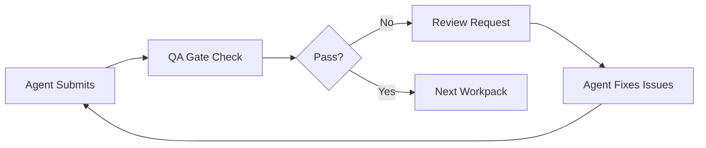
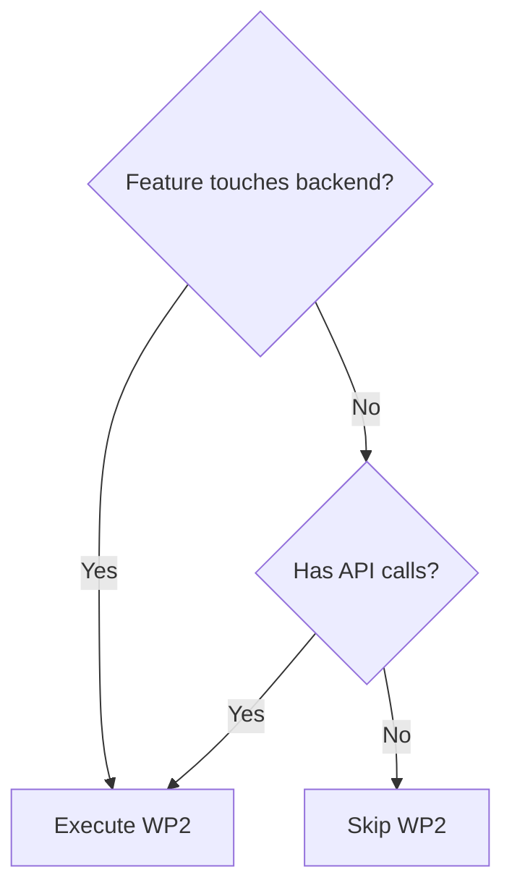
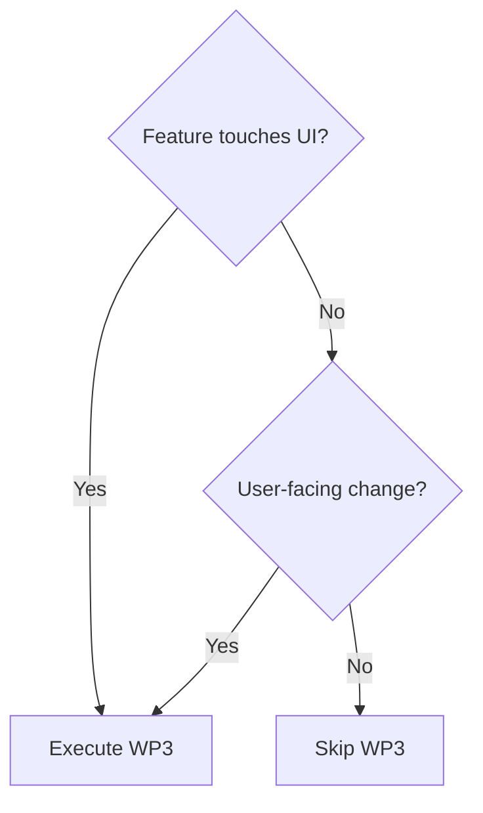
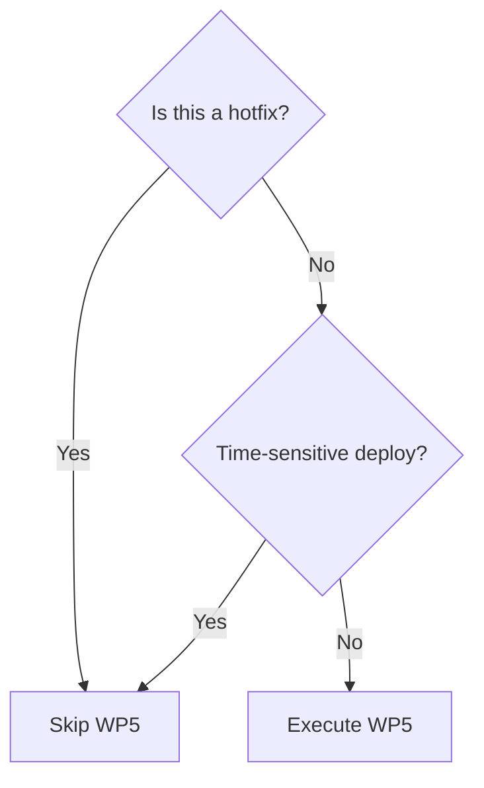

> Last updated: 2026-01-24

## Purpose

Este documento visualiza el flujo completo de trabajo del sistema de agentes, desde la solicitud del usuario hasta el merge final. Usa diagramas Mermaid para mostrar el sistema de workpacks WP1-WP5 y los puntos de decisión.

---

## Complete Flow: WP1 → WP5

---

## Workpack Details

### WP1: Discovery & Spec (Mandatory)

**Duration**: 15-30 min  
**Primary Agent**: Orchestrator  
**Supporting**: Context Indexer

**Inputs**:
- User request
- Existing codebase
- CONTRACTS.md
- DB schema (if applicable)

**Activities**:
1. Read relevant files (schemas, APIs, components)
2. Verify CONTRACTS.md for existing types/APIs
3. Detect assumptions and propose Plan A/B
4. Define input/output contracts
5. Generate spec with explicit constraints

**Outputs**:
- Spec document with context, objective, in/out, restrictions, DoD
- List of files to modify (max 5)
- Assumptions marked explicitly
- Preliminary DoD

**QA Gates**: G1 (contract), G2 (no invention)

**Can Skip?**: ❌ **NO** - WP1 is always mandatory

---

### WP2: Backend Implementation

**Duration**: 30-60 min  
**Primary Agent**: Data/Backend  
**Supporting**: QA (security validation)

**Inputs**:
- Spec from WP1
- API contracts defined
- DB schema requirements

**Activities**:
1. Create API routes (`app/api/*`)
2. Add Zod validation (server-side)
3. Configure RLS policies (Supabase)
4. Add indexes for performance
5. Implement rate limiting
6. Add error handling + logging

**Outputs**:
- API endpoints code
- Zod schemas
- Migrations (if DB changes)
- Verification commands (`typecheck`, `lint`)

**QA Gates**: G1, G2, G3, G4, G5, G7

**Can Skip?**: ✅ Yes - if feature is UI-only (no backend)

---

### WP3: Frontend Implementation

**Duration**: 30-60 min  
**Primary Agent**: UI Builder  
**Supporting**: QA (UX validation)

**Inputs**:
- Spec from WP1
- API contracts from WP2 (if exists)
- Component requirements

**Activities**:
1. Create React components
2. Add UX states (loading/empty/error)
3. Connect to API endpoints (if WP2 exists)
4. Add client-side validation (React Hook Form + Zod)
5. Implement responsive design + dark mode
6. Add accessibility (focus, ARIA, keyboard)

**Outputs**:
- Component code
- UX states implemented
- Verification commands

**QA Gates**: G1, G3, G4, G5, G6, G7

**Can Skip?**: ✅ Yes - if feature is API-only (no UI)

---

### WP4: Integration & Testing

**Duration**: 30-45 min  
**Primary Agent**: QA Gatekeeper  
**Supporting**: All (for integration)

**Inputs**:
- Code from WP2/WP3
- Expected behaviors
- Edge cases list

**Activities**:
1. Write unit tests (critical logic)
2. Write e2e tests (user flows) with Playwright
3. Test edge cases (empty data, errors, offline)
4. Create smoke test checklist
5. Verify performance (load time, query time)

**Outputs**:
- Test suite (unit + e2e)
- Smoke test checklist
- Edge cases coverage report
- Performance metrics

**QA Gates**: G1, G3, G4, G5

**Can Skip?**: ⚠️ Only for hotfixes (critical bugs)

---

### WP5: Polish & Documentation

**Duration**: 15-30 min  
**Primary Agent**: Orchestrator  
**Supporting**: Context Indexer (docs)

**Inputs**:
- Complete feature from WP2-WP4
- Test results
- Performance metrics

**Activities**:
1. Update documentation (README, CONTRACTS.md)
2. Optimize performance (indexes, caching)
3. Cleanup (remove console.logs, TODOs)
4. Final QA gate validation (all G1-G5)
5. Create deploy checklist

**Outputs**:
- Updated documentation
- Performance optimized
- All DoD completed
- Deploy checklist

**QA Gates**: G1-G5 (all gates final check)

**Can Skip?**: ✅ Yes - for hotfixes (deploy ASAP)

---

## Workpack Skip Rules

You can skip workpacks based on feature type:

### UI-Only Feature
**Flow**: WP1 → WP3 → WP4 → WP5

**Example**: Agregar loading skeleton a componente existente
- Skip WP2: No backend changes
- Execute WP3: Implement skeleton UI
- Execute WP4: Test skeleton states
- Execute WP5: Document pattern

---

### API-Only Feature
**Flow**: WP1 → WP2 → WP4 → WP5

**Example**: Agregar endpoint `/api/stats`
- Skip WP3: No UI changes
- Execute WP2: Implement endpoint + RLS
- Execute WP4: Test endpoint (unit + e2e)
- Execute WP5: Document API contract

---

### Hotfix (Critical Bug)
**Flow**: WP1 → WP2/WP3 → WP4 (skip WP5)

**Example**: Fix crash cuando image array está vacío
- Execute WP1: Identify root cause
- Execute WP3: Add guard + placeholder
- Execute WP4: Test fix
- Skip WP5: Deploy immediately

---

### Full Feature (Backend + Frontend)
**Flow**: WP1 → WP2 → WP3 → WP4 → WP5

**Example**: Agregar sistema de favoritos
- Execute WP1: Define tables, API, UI contracts
- Execute WP2: Create `/api/favorites` + RLS
- Execute WP3: Create FavoriteButton component
- Execute WP4: E2E test favorite flow
- Execute WP5: Document + optimize

---

## Agent Responsibilities per Workpack

| Workpack | Primary Agent | Supporting Agents | Main Output |
|----------|--------------|-------------------|-------------|
| **WP1: Discovery** | Orchestrator | Context Indexer | Spec + Contracts |
| **WP2: Backend** | Data/Backend | QA (security) | API + DB |
| **WP3: Frontend** | UI Builder | QA (UX) | Components |
| **WP4: Testing** | QA Gatekeeper | All (integration) | Test Suite |
| **WP5: Polish** | Orchestrator | Context Indexer | Deploy-Ready |

---

## QA Gate Details by Workpack

### WP1 Gates
- **G1: Contract** - All types defined in spec
- **G2: No Invention** - Validated against CONTRACTS.md

### WP2 Gates (Backend)
- **G1: Contract** - API contracts + Zod schemas
- **G2: Security** - RLS, rate limit, no PII
- **G3: States** - Error handling complete
- **G4: Quality** - TypeScript strict, lint pass
- **G5: Verification** - SQL + cURL tests
- **G7: Performance** - EXPLAIN <1000 cost

### WP3 Gates (Frontend)
- **G1: Contract** - Props interfaces defined
- **G3: States** - Loading/empty/error visible
- **G4: Quality** - Tailwind, dark mode, responsive
- **G5: Verification** - Smoke test steps
- **G6: Mobile Sheet** - Scroll + focus correct (if modals)
- **G7: Performance** - No layout shift, memoization

### WP4 Gates (Testing)
- **G1: Contract** - Test contracts match code
- **G3: States** - All states tested
- **G4: Quality** - Tests follow conventions
- **G5: Verification** - Tests reproducible

### WP5 Gates (Polish)
- **G1-G5: All** - Final validation of everything
- **G7: Performance** - Optimizations applied

---

## Iteration Time Estimates

### Fast Track (Simple Feature)
- WP1: 15 min
- WP2 or WP3: 30 min
- WP4: 20 min
- WP5: 15 min
- **Total**: ~80 min (1h 20m)

### Standard Feature (Backend + Frontend)
- WP1: 30 min
- WP2: 45 min
- WP3: 45 min
- WP4: 30 min
- WP5: 30 min
- **Total**: ~3h

### Complex Feature (Multiple Tables, Complex UI)
- WP1: 45 min
- WP2: 60 min
- WP3: 60 min
- WP4: 45 min
- WP5: 30 min
- **Total**: ~4h

### Hotfix (Critical Bug)
- WP1: 10 min
- WP2/WP3: 20 min
- WP4: 15 min
- Skip WP5
- **Total**: ~45 min

---

## Review Request Loop

When a QA Gate fails:

**Review Request includes**:
- Which gate(s) failed (G1-G7)
- Specific issues found
- Expected corrections
- Original DoD checklist

**Agent responds with**:
- Fixes applied
- Re-verification steps
- Updated DoD status

**Loop continues** until all required gates PASS.

---

## Decision Points

### Should I Skip WP2?

**Execute WP2 if**:
- Creating/modifying API routes
- Changing DB schema
- Updating RLS policies
- Adding backend logic

**Skip WP2 if**:
- UI-only changes (styling, components)
- Client-side logic only
- Documentation updates

---

### Should I Skip WP3?

**Execute WP3 if**:
- Creating/modifying React components
- Changing user-facing flows
- Updating styles/layouts
- Adding client-side validation

**Skip WP3 if**:
- API-only changes
- Backend scripts
- DB migrations only
- Internal tooling

---

### Should I Skip WP5?

**Skip WP5 if**:
- Critical production bug (hotfix)
- Time-sensitive deploy needed
- Feature is experimental/behind flag

**Execute WP5 if**:
- Standard feature launch
- Performance optimization needed
- Documentation important

---

## Common Patterns

### Pattern 1: Simple CRUD API
**Flow**: WP1 → WP2 → WP4 → WP5 (skip WP3)

**Timeline**:
- WP1 (20m): Define API contract
- WP2 (40m): Implement endpoint + RLS
- WP4 (20m): Test with cURL + unit tests
- WP5 (15m): Document in CONTRACTS.md

---

### Pattern 2: UI Component Enhancement
**Flow**: WP1 → WP3 → WP4 → WP5 (skip WP2)

**Timeline**:
- WP1 (15m): Identify component + changes needed
- WP3 (30m): Implement UI changes + states
- WP4 (20m): Test component states
- WP5 (15m): Document pattern if reusable

---

### Pattern 3: Full Stack Feature
**Flow**: WP1 → WP2 → WP3 → WP4 → WP5

**Timeline**:
- WP1 (30m): Define full contracts (API + UI)
- WP2 (45m): Backend implementation
- WP3 (45m): Frontend implementation
- WP4 (30m): Integration tests (e2e)
- WP5 (30m): Docs + performance optimization

---

## Changelog

### v1.0 (2026-01-24)
- Initial workflow diagram documentation
- Complete WP1-WP5 flow with Mermaid diagrams
- Workpack skip rules and decision trees
- Agent responsibilities matrix
- Time estimates per feature type
- Common patterns and examples