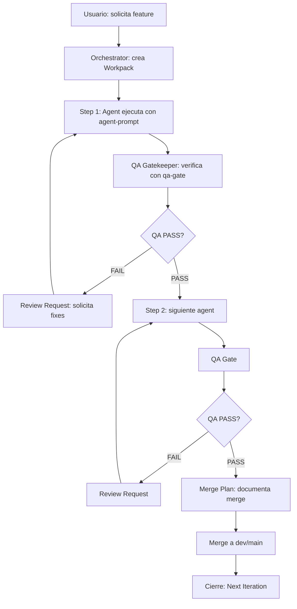

> Sistema estandarizado de templates para vibe-coding con agentes especializados  
> Last updated: 2026-01-24

## Propósito

Este directorio contiene los **5 templates core** para orquestar trabajo entre agentes (Orchestrator, UI Builder, Data-Backend, QA Gatekeeper) de forma predecible, accionable y libre de invenciones.

Cada template es un **contrato** que:
- Define inputs/outputs claros (parseable por un Orchestrator)
- Impone límites operacionales (máx 3 archivos, máx 3 agentes, 1 micro-tarea)
- Previene invención de APIs/schemas/props con sistema de assumptions
- Garantiza calidad con Quality Gates (G1–G5)
- Incluye verificación reproducible y rollback plan

---

## Templates Disponibles

| Template | Purpose | Cuándo Usarlo | Duration |
|----------|---------|---------------|----------|
| **[workpack.md](./workpack.md)** | Definir macro-tarea (1-3 steps) | Inicio de ciclo, involucra múltiples agentes | 30min–2h |
| **[agent-prompt.md](./agent-prompt.md)** | Ejecutar micro-tarea con 1 agente | Delegar tarea específica a UI/Data/QA | ≤30min |
| **[qa-gate.md](./qa-gate.md)** | Verificar G1–G5 antes de merge | Después de implementación, antes de PR | 15-30min |
| **[merge-plan.md](./merge-plan.md)** | Documentar merge seguro | Después de QA PASS, antes de merge | 10-15min |
| **[review-request.md](./review-request.md)** | Solicitar correcciones | Cuando QA gate FALLA o hay blockers | 10-20min |

---

## Flujo de Trabajo (Happy Path)



### Paso a Paso

1. **Inicio**: Usuario solicita feature → Orchestrator crea `workpack.md`
   - Define 1-3 steps, asigna agentes, scope claro
   - Output: Workpack ID (ej: WP#024)

2. **Ejecución**: Por cada step, Orchestrator usa `agent-prompt.md`
   - Agente especializado (UI Builder, Data-Backend) implementa
   - Output: Código + smoke tests

3. **Validación**: QA Gatekeeper usa `qa-gate.md`
   - Verifica G1–G5 (contract, security, UX, edge cases, verification)
   - Output: PASS/FAIL + notes

4. **Corrección** (si QA FAIL): QA usa `review-request.md`
   - Lista blocking/non-blocking issues
   - Agente corrige y re-submits
   - Loop hasta QA PASS

5. **Merge**: Orchestrator usa `merge-plan.md`
   - Documenta files, commands, smoke tests, rollback
   - Ejecuta merge seguro
   - Output: PR merged, monitoring activo

6. **Cierre**: Actualiza Workpack con "Next Iteration Suggestion"
   - Siguiente micro-tarea entra en nuevo ciclo

---

## Convenciones (NO NEGOCIABLES)

### Placeholders Estandarizados

```
<FEATURE>          - Nombre de feature (ej: "mobile-search-filters")
<WORKPACK_ID>      - ID de workpack (ej: "WP#024")
<AGENT_NAME>       - Orchestrator / UI Builder / Data-Backend / QA Gatekeeper
<REPO_AREA>        - Área del repo (ej: "app/", "components/search/")
<FILES>            - Lista de paths (ej: "app/api/visits/route.ts")
<DB_TABLES>        - Tablas Supabase (ej: "visits", "units")
<API_ENDPOINT>     - Ruta API (ej: "/api/visits")
<PROPS>            - Props TypeScript (ej: "{ userId: string; limit?: number }")
<RISK_LEVEL>       - High / Medium / Low
<BRANCH_NAME>      - Git branch (ej: "feat/visits")
<COMMIT_HASH>      - Hash corto (7 chars)
```

### Límites Operacionales

- ✅ **1 micro-tarea** por iteración (≤30 min ejecución)
- ✅ **Máx 3 archivos** tocados por tarea (salvo justificación)
- ✅ **Máx 3 agentes** involucrados por workpack
- ✅ **Plan A/Plan B** cuando falta información (default: Plan A más conservador)

### Quality Gates (G1–G5)

Todos los templates referencian estos 5 gates:

- **G1 Contract**: Tipos TS claros, Zod schemas, sin `any`
- **G2 Security**: Auth, RLS, rate-limit, sanitización, sin PII
- **G3 UX States**: Loading, empty, error, success
- **G4 Edge Cases**: Mobile, back/forward, refresh, offline, data faltante
- **G5 Verification**: Smoke tests reproducibles (≤5 pasos)

### Sistema Anti-Invención

Todos los templates incluyen:

```markdown
## Assumptions
⚠️ **Si cualquier assumption es falsa, STOP y pedir aclaración**

- [ ] Tabla `<DB_TABLE>` existe con columnas `<COLUMNS>`
- [ ] Endpoint `<API_ENDPOINT>` retorna `{ data: <SHAPE>, error?: string }`
- [ ] Componente `<COMPONENT>` acepta props `<PROPS>`

## Open Questions (max 3)
1. ¿El endpoint debe validar X server-side o client-side?
2. ¿Qué hacer si Y falla: retry, fallback, error?

⚠️ **Si no tienes respuesta, provee Plan A/Plan B y elige el más conservador**
```

---

## Uso con Orchestrator (Parsing)

Los templates están diseñados para ser parseables automáticamente:

### Campos Obligatorios (marcados con ✅)

Todos los templates tienen:
- `## Context ✅` - Inputs necesarios
- `## Objective ✅` - Qué se busca lograr
- `## Output Contract ✅` - Formato de respuesta
- `## Quality Gates (G1–G5) ✅` - Checklist de calidad
- `## Verification ✅` - Smoke tests
- `## Merge Readiness ✅` - PASS/FAIL/BLOCKED
- `## Next Iteration Suggestion ✅` - Siguiente tarea

### Estados Posibles

- **Workpack**: PENDING / IN PROGRESS / DONE / BLOCKED
- **QA Gate**: PASS / FAIL / BLOCKED
- **Merge Plan**: READY / BLOCKED / WAITING

### Extracción Automática (ejemplo con regex)

```typescript
// Extraer Merge Readiness status
const statusMatch = content.match(/## Merge Readiness.*\n- \*\*Status\*\*: (PASS|FAIL|BLOCKED|READY|PENDING)/s);
const status = statusMatch?.[1];

// Extraer Next Iteration
const nextMatch = content.match(/## Next Iteration Suggestion ✅\n.*\n- (.+)/);
const nextTask = nextMatch?.[1];

// Extraer Quality Gates
const gatesMatch = content.matchAll(/- \[ \] \*\*G(\d)\s+(.+?)\*\*:/g);
const gates = Array.from(gatesMatch).map(m => ({ id: m[1], name: m[2] }));
```

---

## Checklist de Calidad del Template

Antes de usar un template en producción, verificar:

- [ ] Tiene header con versión + changelog
- [ ] Usa placeholders consistentes (`<PLACEHOLDER>`)
- [ ] Campos obligatorios marcados con ✅
- [ ] Incluye sistema anti-invención (Assumptions + Open Questions)
- [ ] Define límites operacionales (3 archivos, 3 agentes, 1 tarea)
- [ ] Tiene Quality Gates (G1–G5) explícitos
- [ ] Incluye Merge Readiness con PASS/FAIL
- [ ] Tiene Next Iteration Suggestion
- [ ] Smoke tests son reproducibles (≤5 pasos)
- [ ] Rollback plan documentado (si aplica)

---

## Mantenimiento

### Actualizar un Template

1. Incrementar versión (v1.1 → v1.2)
2. Agregar entrada en Changelog (máx 5 bullets históricos)
3. Mantener retrocompatibilidad de placeholders
4. Actualizar este README si cambia el flujo

### Agregar Nuevo Template

1. Usar estructura estándar (ver sección "Estructura Template Base")
2. Agregar entrada en tabla de "Templates Disponibles"
3. Actualizar diagrama de flujo si altera el ciclo
4. Documentar nuevos placeholders en "Convenciones"

---

## Estructura Template Base

Todos los templates deben seguir este orden:

```markdown
# [Template Name] v1.1
> Last updated: YYYY-MM-DD
> Changelog: [bullets de cambios]

## Purpose
[1 línea]

## Context ✅
[Inputs necesarios]

## Objective ✅
[Qué se busca lograr]

## Scope (In/Out) ✅
- ✅ In: [máx 3]
- ❌ Out: [máx 3]

## Inputs ✅
[Placeholders con descripción]

## Output Contract ✅
[Formato mandatorio de respuesta]

## Quality Gates (G1–G5) ✅
[Checklist PASS/FAIL/N/A]

## Verification (Smoke + Edge Cases) ✅
[Pasos reproducibles]

## Risks / Tradeoffs
[Máx 5 bullets]

## Assumptions
[Lo que se asume válido]

## Open Questions (max 3)
[Preguntas sin resolver]

## Merge Readiness ✅
- Status: PASS / FAIL / BLOCKED
- Reason: [1 línea]

## Next Iteration Suggestion ✅
[1 bullet]
```

---

## FAQs

### ¿Cuándo usar `workpack.md` vs `agent-prompt.md`?

- **Workpack**: Macro-tarea (1-3 steps), involucra múltiples agentes, duración 30min–2h
- **Agent Prompt**: Micro-tarea (1 step), 1 agente, duración ≤30min

**Regla**: Si puedes completarlo en ≤30min con 1 agente, usa `agent-prompt.md`. Si no, usa `workpack.md`.

### ¿Qué hacer si un assumption es falso?

**STOP inmediatamente**. No inventes. Opciones:
1. Pregunta al Orchestrator o PM
2. Provee **Plan A** (conservador, sin inventar) y **Plan B** (óptimo, requiere confirmar)
3. Elige Plan A por default

### ¿Qué pasa si necesito tocar >3 archivos?

**Justifica o divide**. Opciones:
1. Justificar en `## Risks / Tradeoffs` (ej: "refactor necesario para consistencia")
2. Dividir en 2 tareas secuenciales (preferido)

### ¿Cómo manejar QA FAIL recurrente (>3 ciclos)?

**Escalar a Orchestrator**. Probable causa:
- Scope mal definido en Workpack original
- Agente necesita más contexto/training
- Issue sistémico (ej: falta setup de ENV, DB seed)

### ¿Puedo modificar la estructura del template?

**No sin consenso de equipo**. La consistencia es crítica para parsing automático. Si necesitas cambios:
1. Proponer en issue/PR
2. Actualizar README + todos los templates afectados
3. Incrementar versión (v1.x → v2.0 si rompe retrocompatibilidad)

---

## Recursos

- **Stack**: Next.js 14 (App Router), React 18, TypeScript strict, Tailwind, Zod, Supabase
- **Rules**: Ver `.cursor/rules/00-core.mdc` para reglas del proyecto
- **Agents**: Ver `app/agents/` para definiciones de agentes especializados

---

## Changelog del Sistema

### v1.1 (2026-01-24)
- ✅ Profesionalización inicial de 5 templates
- ✅ Estructura estandarizada con campos obligatorios ✅
- ✅ Sistema anti-invención (Assumptions + Open Questions)
- ✅ Límites operacionales (3 archivos, 3 agentes, 1 tarea)
- ✅ Placeholders consistentes (`<PLACEHOLDER>`)
- ✅ Quality Gates explícitos (G1–G5)
- ✅ Merge Readiness + Next Iteration en todos
- ✅ Rollback plans documentados
- ✅ Copy/paste friendly, sin relleno filosófico

### v1.0 (antes)
- Templates iniciales sin estructura estandarizada
- Inconsistencias de naming, orden, placeholders
- Sin sistema anti-invención
- Sin límites operacionales explícitos