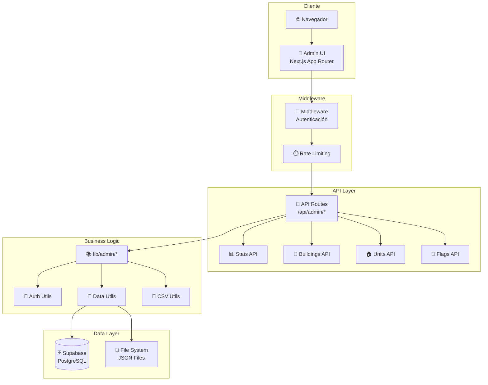
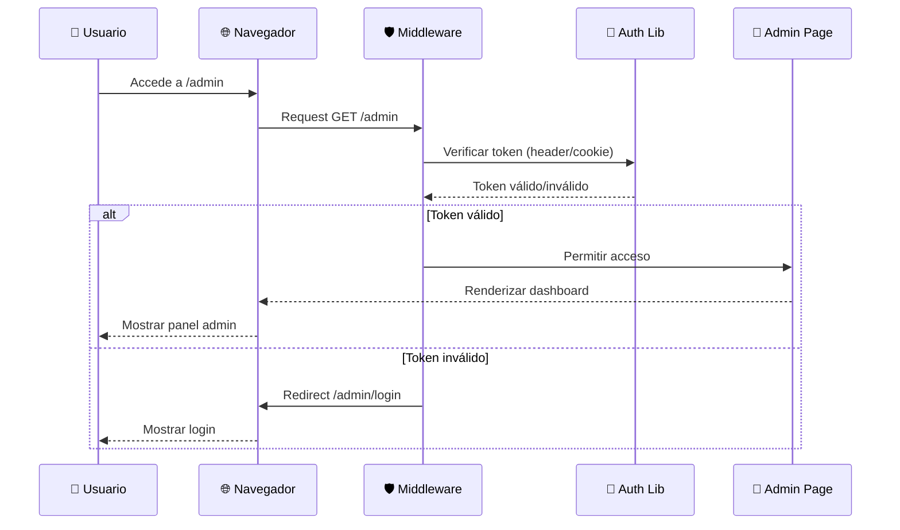
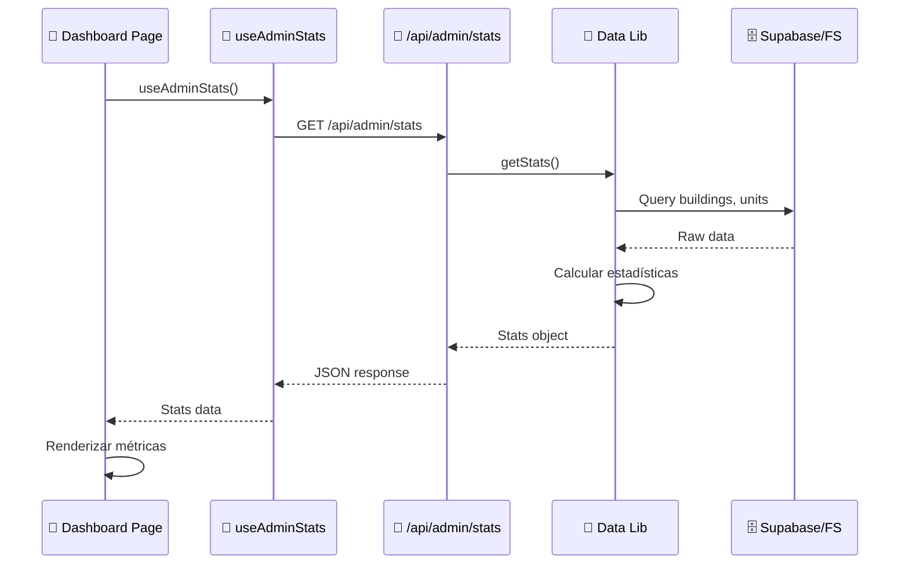
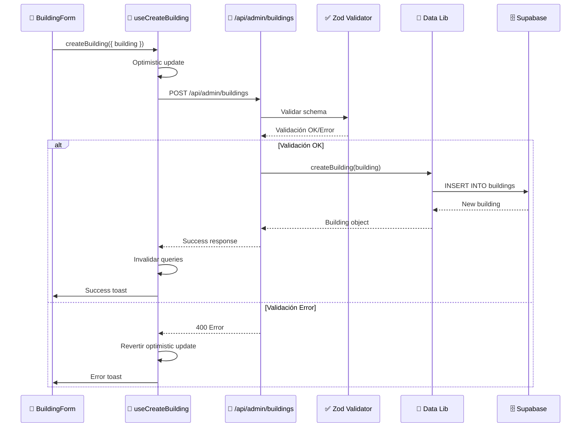
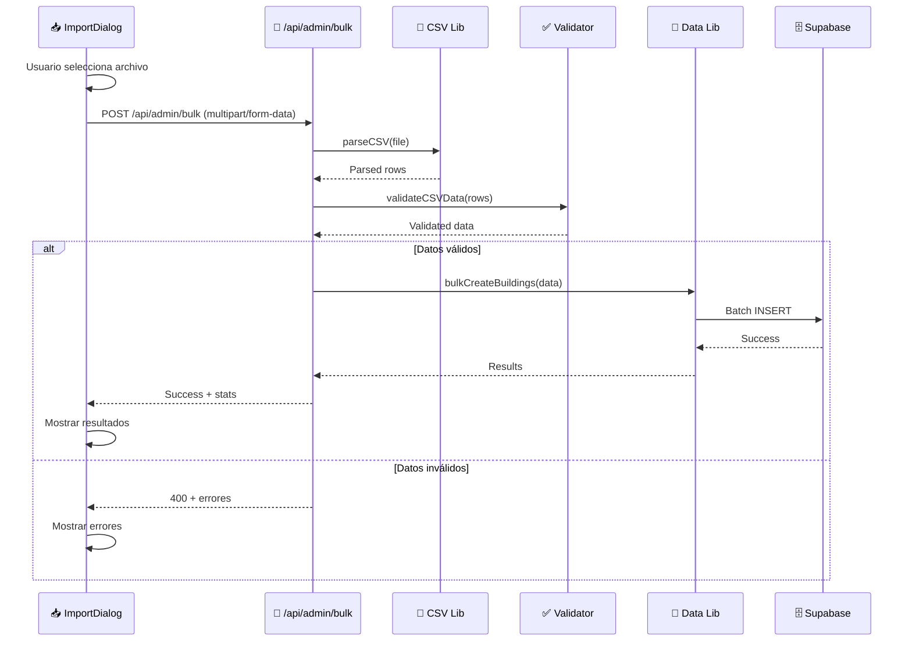
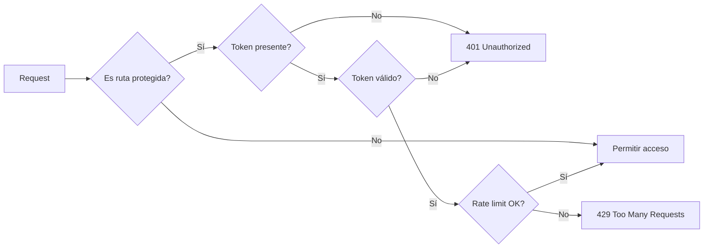
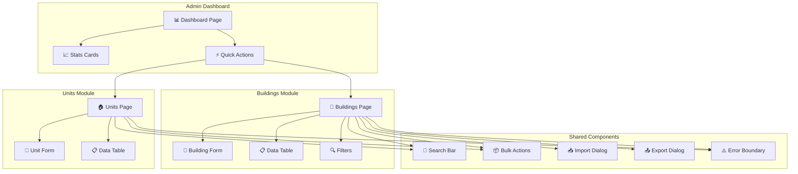

# 🏗️ Arquitectura del Sistema de Administración

## 📋 Índice

1. [Visión General](#visión-general)
2. [Arquitectura en Capas](#arquitectura-en-capas)
3. [Estructura de Directorios](#estructura-de-directorios)
4. [Flujos de Datos](#flujos-de-datos)
5. [Módulos Principales](#módulos-principales)
6. [Seguridad y Autenticación](#seguridad-y-autenticación)
7. [Mejoras Propuestas](#mejoras-propuestas)

---

## 🎯 Visión General

El sistema de administración está diseñado como un panel de control completo para gestionar edificios, unidades, feature flags y métricas del sistema. Utiliza Next.js 14 App Router con React Server Components (RSC) y componentes cliente cuando es necesario.

### Diagrama de Arquitectura General



---

## 🏛️ Arquitectura en Capas

### Capa 1: Presentación (UI Layer)

```
┌─────────────────────────────────────────────────────────┐
│                    PRESENTACIÓN LAYER                    │
├─────────────────────────────────────────────────────────┤
│                                                           │
│  📱 Pages (RSC)                                          │
│  ├── /admin/page.tsx              → Dashboard            │
│  ├── /admin/buildings/page.tsx    → Gestión Edificios    │
│  ├── /admin/units/page.tsx        → Gestión Unidades     │
│  ├── /admin/flags/page.tsx        → Feature Flags        │
│  └── /admin/completeness/page.tsx → Completitud Datos    │
│                                                           │
│  🧩 Components (Client)                                  │
│  ├── BuildingForm.tsx             → Formulario Edificio  │
│  ├── UnitForm.tsx                 → Formulario Unidad    │
│  ├── DataTable.tsx                → Tabla de Datos       │
│  ├── FilterPanel.tsx              → Filtros              │
│  ├── SearchBar.tsx                → Búsqueda            │
│  ├── BulkActions.tsx              → Acciones Masivas     │
│  ├── ImportDialog.tsx             → Importar CSV         │
│  ├── ExportDialog.tsx             → Exportar Datos        │
│  ├── FlagToggle.tsx              → Toggle Feature Flag   │
│  └── ErrorBoundary.tsx            → Manejo Errores       │
│                                                           │
│  🎣 Hooks (Client State)                                 │
│  ├── useAdminStats.ts             → Estadísticas          │
│  ├── useAdminBuildings.ts         → CRUD Edificios       │
│  └── useAdminUnits.ts             → CRUD Unidades         │
│                                                           │
└─────────────────────────────────────────────────────────┘
```

### Capa 2: API Layer

```
┌─────────────────────────────────────────────────────────┐
│                      API LAYER                           │
├─────────────────────────────────────────────────────────┤
│                                                           │
│  🔌 Route Handlers (Server Actions)                      │
│  ├── /api/admin/stats/route.ts                          │
│  │   └── GET → Estadísticas del sistema                 │
│  │                                                       │
│  ├── /api/admin/buildings/route.ts                      │
│  │   ├── GET  → Listar edificios (paginado)             │
│  │   └── POST → Crear edificio                          │
│  │                                                       │
│  ├── /api/admin/buildings/[id]/route.ts                 │
│  │   ├── GET    → Obtener edificio                      │
│  │   ├── PUT    → Actualizar edificio                   │
│  │   └── DELETE → Eliminar edificio                     │
│  │                                                       │
│  ├── /api/admin/units/route.ts                          │
│  │   ├── GET  → Listar unidades (paginado)             │
│  │   └── POST → Crear unidad                            │
│  │                                                       │
│  ├── /api/admin/units/[id]/route.ts                     │
│  │   ├── GET    → Obtener unidad                        │
│  │   ├── PUT    → Actualizar unidad                     │
│  │   └── DELETE → Eliminar unidad                       │
│  │                                                       │
│  ├── /api/admin/bulk/route.ts                           │
│  │   └── POST → Operaciones masivas                      │
│  │                                                       │
│  └── /api/admin/completeness/route.ts                   │
│       └── GET → Análisis de completitud                 │
│                                                           │
│  🛡️ Middleware Protection                                │
│  └── middleware.ts                                       │
│      ├── Verificación de rutas protegidas               │
│      ├── Autenticación (token header/cookie)            │
│      └── Rate limiting (20 req/60s por IP)              │
│                                                           │
└─────────────────────────────────────────────────────────┘
```

### Capa 3: Business Logic Layer

```
┌─────────────────────────────────────────────────────────┐
│                  BUSINESS LOGIC LAYER                    │
├─────────────────────────────────────────────────────────┤
│                                                           │
│  🔐 lib/admin/auth.ts                                    │
│  ├── verifyAdminToken()         → Validar token         │
│  ├── getAdminTokenFromRequest() → Extraer token         │
│  ├── isAuthenticatedRequest()   → Verificar auth        │
│  └── unauthorizedResponse()     → Respuesta 401         │
│                                                           │
│  💾 lib/admin/data.ts                                    │
│  ├── getBuildings()              → Obtener edificios    │
│  ├── getBuildingById()           → Obtener por ID       │
│  ├── createBuilding()            → Crear edificio       │
│  ├── updateBuilding()            → Actualizar           │
│  ├── deleteBuilding()            → Eliminar             │
│  ├── getUnits()                  → Obtener unidades     │
│  ├── createUnit()                → Crear unidad          │
│  ├── updateUnit()                → Actualizar unidad    │
│  └── deleteUnit()                → Eliminar unidad       │
│                                                           │
│  📄 lib/admin/csv.ts                                     │
│  ├── parseCSV()                  → Parsear CSV          │
│  ├── validateCSVData()           → Validar datos         │
│  └── transformCSVToBuilding()    → Transformar a modelo  │
│                                                           │
│  📊 lib/admin/data-optimized.ts                          │
│  └── Funciones optimizadas para grandes volúmenes        │
│                                                           │
│  🏢 lib/admin/assetplan-csv.ts                           │
│  └── Procesamiento específico de AssetPlan               │
│                                                           │
└─────────────────────────────────────────────────────────┘
```

### Capa 4: Data Layer

```
┌─────────────────────────────────────────────────────────┐
│                      DATA LAYER                          │
├─────────────────────────────────────────────────────────┤
│                                                           │
│  🗄️ Supabase (PostgreSQL)                                │
│  ├── buildings table                                    │
│  ├── units table                                        │
│  ├── admin_users table (futuro)                         │
│  └── admin_audit_log table (futuro)                     │
│                                                           │
│  📁 File System (JSON)                                   │
│  ├── data/buildings/*.json                              │
│  └── data/buildings.json (fallback)                     │
│                                                           │
│  🔄 Data Adapters                                        │
│  ├── Supabase Adapter (producción)                      │
│  └── File System Adapter (desarrollo/fallback)          │
│                                                           │
└─────────────────────────────────────────────────────────┘
```

---

## 📁 Estructura de Directorios

```
app/
├── admin/                          # 🎯 Admin Pages (RSC)
│   ├── layout.tsx                  # Layout con metadata
│   ├── layout-client.tsx           # Layout cliente (nav, providers)
│   ├── page.tsx                    # Dashboard principal
│   ├── buildings/
│   │   └── page.tsx                # Gestión de edificios
│   ├── units/
│   │   └── page.tsx                # Gestión de unidades
│   ├── flags/
│   │   ├── page.tsx                # Feature flags
│   │   ├── constants.ts            # Constantes de flags
│   │   └── FlagsAdminClient.tsx    # Cliente de flags
│   └── completeness/
│       └── page.tsx                # Análisis de completitud
│
├── api/
│   └── admin/                      # 🔌 Admin API Routes
│       ├── stats/
│       │   └── route.ts            # GET /api/admin/stats
│       ├── buildings/
│       │   ├── route.ts            # GET, POST /api/admin/buildings
│       │   └── [id]/
│       │       └── route.ts        # GET, PUT, DELETE /api/admin/buildings/:id
│       ├── units/
│       │   ├── route.ts            # GET, POST /api/admin/units
│       │   └── [id]/
│       │       └── route.ts        # GET, PUT, DELETE /api/admin/units/:id
│       ├── bulk/
│       │   └── route.ts            # POST /api/admin/bulk
│       └── completeness/
│           └── route.ts            # GET /api/admin/completeness
│
components/
└── admin/                          # 🧩 Admin Components
    ├── BuildingForm.tsx            # Formulario CRUD edificio
    ├── UnitForm.tsx                # Formulario CRUD unidad
    ├── DataTable.tsx               # Tabla con paginación, sorting
    ├── FilterPanel.tsx             # Panel de filtros avanzados
    ├── SearchBar.tsx               # Barra de búsqueda
    ├── BulkActions.tsx             # Acciones masivas (delete, export)
    ├── ImportDialog.tsx            # Dialog para importar CSV
    ├── ExportDialog.tsx            # Dialog para exportar datos
    ├── FlagToggle.tsx              # Toggle para feature flags
    ├── ConfirmDialog.tsx           # Dialog de confirmación
    └── ErrorBoundary.tsx           # Error boundary para admin

hooks/
├── useAdminStats.ts                # 🎣 Hook para estadísticas
├── useAdminBuildings.ts            # Hook CRUD edificios
└── useAdminUnits.ts                # Hook CRUD unidades (si existe)

lib/
└── admin/                          # 📚 Admin Business Logic
    ├── auth.ts                     # Utilidades de autenticación
    ├── data.ts                     # CRUD operations
    ├── data-optimized.ts           # Versión optimizada
    ├── csv.ts                      # Procesamiento CSV
    └── assetplan-csv.ts            # Procesador específico AssetPlan

middleware.ts                       # 🛡️ Middleware de protección
```

---

## 🔄 Flujos de Datos

### Flujo 1: Autenticación y Acceso



### Flujo 2: Lectura de Datos (Dashboard Stats)



### Flujo 3: Crear Edificio (CRUD)



### Flujo 4: Importar CSV



---

## 🧩 Módulos Principales

### 1. Dashboard Module

**Responsabilidades:**
- Mostrar métricas generales del sistema
- Estadísticas en tiempo real
- Accesos rápidos a módulos principales

**Componentes:**
- `app/admin/page.tsx` - Página principal
- `hooks/useAdminStats.ts` - Hook de datos
- `app/api/admin/stats/route.ts` - API endpoint

**Métricas mostradas:**
- Total edificios
- Total unidades
- Unidades disponibles
- Edificios con datos incompletos
- Distribución por comuna
- Distribución por tipología
- Rango de precios

### 2. Buildings Management Module

**Responsabilidades:**
- CRUD completo de edificios
- Búsqueda y filtrado
- Paginación
- Import/Export CSV
- Validación de datos

**Componentes:**
- `app/admin/buildings/page.tsx` - Lista y gestión
- `components/admin/BuildingForm.tsx` - Formulario
- `components/admin/DataTable.tsx` - Tabla de datos
- `components/admin/FilterPanel.tsx` - Filtros
- `components/admin/SearchBar.tsx` - Búsqueda
- `hooks/useAdminBuildings.ts` - Lógica CRUD

**API Endpoints:**
- `GET /api/admin/buildings` - Listar (paginado)
- `POST /api/admin/buildings` - Crear
- `GET /api/admin/buildings/:id` - Obtener
- `PUT /api/admin/buildings/:id` - Actualizar
- `DELETE /api/admin/buildings/:id` - Eliminar

### 3. Units Management Module

**Responsabilidades:**
- CRUD completo de unidades
- Relación con edificios
- Validación de disponibilidad
- Gestión de precios y tipologías

**Componentes:**
- `app/admin/units/page.tsx` - Lista y gestión
- `components/admin/UnitForm.tsx` - Formulario
- `hooks/useAdminUnits.ts` - Lógica CRUD (si existe)

**API Endpoints:**
- `GET /api/admin/units` - Listar (paginado)
- `POST /api/admin/units` - Crear
- `GET /api/admin/units/:id` - Obtener
- `PUT /api/admin/units/:id` - Actualizar
- `DELETE /api/admin/units/:id` - Eliminar

### 4. Feature Flags Module

**Responsabilidades:**
- Gestión de feature flags
- Overrides temporales
- Expiración automática
- Estado en tiempo real

**Componentes:**
- `app/admin/flags/page.tsx` - Panel de flags
- `components/admin/FlagToggle.tsx` - Toggle switch
- `lib/flags.ts` - Lógica de flags

**API Endpoints:**
- `GET /api/flags/override` - Estado actual
- `POST /api/flags/override` - Aplicar override

### 5. Data Completeness Module

**Responsabilidades:**
- Análisis de completitud de datos
- Identificación de campos faltantes
- Reportes de calidad de datos

**Componentes:**
- `app/admin/completeness/page.tsx` - Análisis
- `app/api/admin/completeness/route.ts` - API de análisis

---

## 🔐 Seguridad y Autenticación

### Arquitectura de Seguridad Actual

```
┌─────────────────────────────────────────────────────────┐
│              SEGURIDAD Y AUTENTICACIÓN                   │
├─────────────────────────────────────────────────────────┤
│                                                           │
│  🛡️ Middleware Protection                                │
│  ├── Rutas protegidas: /admin/*, /api/admin/*           │
│  ├── Verificación de token en cada request               │
│  └── Rate limiting: 20 req/60s por IP                    │
│                                                           │
│  🔑 Autenticación Actual (Básica)                        │
│  ├── Token único: ADMIN_TOKEN env var                    │
│  ├── Métodos: Header (x-admin-token) o Cookie           │
│  ├── Dev: Permite acceso sin token (con warning)         │
│  └── Prod: Requiere token válido                         │
│                                                           │
│  ⚠️ Limitaciones Actuales                                │
│  ├── Sin roles ni permisos granulares                    │
│  ├── Sin expiración de sesión                            │
│  ├── Sin auditoría de acciones                           │
│  └── Sin 2FA                                              │
│                                                           │
└─────────────────────────────────────────────────────────┘
```

### Flujo de Autenticación



---

## 🚀 Mejoras Propuestas

### Fase 1: Autenticación Mejorada

```
┌─────────────────────────────────────────────────────────┐
│           MEJORAS FASE 1: AUTENTICACIÓN                 │
├─────────────────────────────────────────────────────────┤
│                                                           │
│  ✅ Integración con Supabase Auth                        │
│     ├── Login con email/password                         │
│     ├── Sesiones con JWT                                │
│     └── Refresh tokens automáticos                       │
│                                                           │
│  ✅ Sistema de Roles                                     │
│     ├── admin (acceso completo)                          │
│     ├── editor (CRUD sin delete)                         │
│     └── viewer (solo lectura)                            │
│                                                           │
│  ✅ Página de Login                                      │
│     └── /admin/login                                     │
│                                                           │
│  ✅ Middleware mejorado                                  │
│     ├── Verificación de roles                            │
│     └── Redirección automática                           │
│                                                           │
└─────────────────────────────────────────────────────────┘
```

### Fase 2: Auditoría y Logging

```
┌─────────────────────────────────────────────────────────┐
│          MEJORAS FASE 2: AUDITORÍA                       │
├─────────────────────────────────────────────────────────┤
│                                                           │
│  ✅ Tabla de auditoría                                   │
│     ├── admin_audit_log                                  │
│     ├── Campos: user_id, action, resource, timestamp     │
│     └── Índices para búsqueda rápida                     │
│                                                           │
│  ✅ Logging automático                                   │
│     ├── CREATE, UPDATE, DELETE                           │
│     ├── Import/Export                                    │
│     └── Cambios de configuración                         │
│                                                           │
│  ✅ Panel de auditoría                                   │
│     └── /admin/audit                                     │
│                                                           │
└─────────────────────────────────────────────────────────┘
```

### Fase 3: Mejoras de UX

```
┌─────────────────────────────────────────────────────────┐
│            MEJORAS FASE 3: UX                            │
├─────────────────────────────────────────────────────────┤
│                                                           │
│  ✅ Notificaciones en tiempo real                        │
│     └── WebSockets o Server-Sent Events                  │
│                                                           │
│  ✅ Búsqueda avanzada                                    │
│     ├── Filtros múltiples                                │
│     ├── Búsqueda por texto completo                      │
│     └── Guardar búsquedas frecuentes                     │
│                                                           │
│  ✅ Exportaciones mejoradas                              │
│     ├── Excel, PDF                                       │
│     ├── Templates personalizables                        │
│     └── Programación de exports                          │
│                                                           │
│  ✅ Dashboard personalizable                             │
│     ├── Widgets configurables                            │
│     └── Guardar layouts                                  │
│                                                           │
└─────────────────────────────────────────────────────────┘
```

### Fase 4: Performance y Escalabilidad

```
┌─────────────────────────────────────────────────────────┐
│      MEJORAS FASE 4: PERFORMANCE                         │
├─────────────────────────────────────────────────────────┤
│                                                           │
│  ✅ Caché inteligente                                    │
│     ├── Redis para stats                                 │
│     └── Invalidación selectiva                           │
│                                                           │
│  ✅ Paginación optimizada                                │
│     ├── Cursor-based pagination                          │
│     └── Virtual scrolling                                │
│                                                           │
│  ✅ Optimización de queries                              │
│     ├── Índices en BD                                    │
│     ├── Query batching                                   │
│     └── Lazy loading                                     │
│                                                           │
│  ✅ CDN para assets                                      │
│     └── Imágenes optimizadas                             │
│                                                           │
└─────────────────────────────────────────────────────────┘
```

---

## 📊 Diagrama de Componentes Interactivos



---

## 🔄 Flujo de Estados (State Management)

```
┌─────────────────────────────────────────────────────────┐
│              GESTIÓN DE ESTADO                           │
├─────────────────────────────────────────────────────────┤
│                                                           │
│  🎣 React Query (Server State)                          │
│     ├── useAdminStats()                                  │
│     ├── useAdminBuildings()                              │
│     └── useAdminUnits()                                  │
│                                                           │
│  📦 Características:                                     │
│     ├── Caché automático                                 │
│     ├── Invalidación inteligente                         │
│     ├── Optimistic updates                               │
│     ├── Retry automático                                 │
│     └── Background refetch                               │
│                                                           │
│  🎯 Estado Local (Client State)                          │
│     ├── Formularios (React Hook Form)                    │
│     ├── Filtros (useState)                               │
│     ├── Paginación (useState)                            │
│     └── UI state (modals, dialogs)                       │
│                                                           │
└─────────────────────────────────────────────────────────┘
```

---

## 📝 Convenciones y Estándares

### Naming Conventions

- **Pages**: `page.tsx` (Next.js App Router)
- **Components**: PascalCase (`BuildingForm.tsx`)
- **Hooks**: camelCase con prefijo `use` (`useAdminStats.ts`)
- **API Routes**: `route.ts` en carpetas nombradas
- **Utils**: camelCase (`auth.ts`, `data.ts`)

### TypeScript

- ✅ TypeScript estricto
- ✅ Sin `any` permitido
- ✅ Tipos explícitos en funciones públicas
- ✅ Interfaces para props de componentes

### Estilos

- ✅ Tailwind CSS con variables CSS
- ✅ Dark theme por defecto
- ✅ `rounded-2xl` para cards
- ✅ Focus rings para accesibilidad
- ✅ Responsive design mobile-first

### Validación

- ✅ Zod para validación server-side
- ✅ Validación en API routes
- ✅ Validación en formularios (client-side)

### Error Handling

- ✅ Error boundaries en componentes críticos
- ✅ Try-catch en API routes
- ✅ Toast notifications para feedback
- ✅ Logging de errores (sin PII)

---

## 🎯 Roadmap de Implementación

### ✅ Completado

- [x] Estructura básica de admin
- [x] Dashboard con estadísticas
- [x] CRUD de edificios
- [x] CRUD de unidades
- [x] Feature flags
- [x] Análisis de completitud
- [x] Autenticación básica
- [x] Rate limiting
- [x] Import/Export CSV

### 🚧 En Progreso

- [ ] Mejoras de UX
- [ ] Optimizaciones de performance

### 📋 Pendiente

- [ ] Autenticación con Supabase Auth
- [ ] Sistema de roles y permisos
- [ ] Auditoría de acciones
- [ ] Notificaciones en tiempo real
- [ ] Dashboard personalizable
- [ ] Exportaciones avanzadas (Excel, PDF)

---

## 📚 Referencias

- [Next.js 14 App Router](https://nextjs.org/docs/app)
- [React Query](https://tanstack.com/query/latest)
- [Zod Validation](https://zod.dev/)
- [Supabase Auth](https://supabase.com/docs/guides/auth)
- [Tailwind CSS](https://tailwindcss.com/)

---

**Última actualización:** 2025-01-XX  
**Versión:** 1.0.0  
**Mantenido por:** Equipo de Desarrollo


