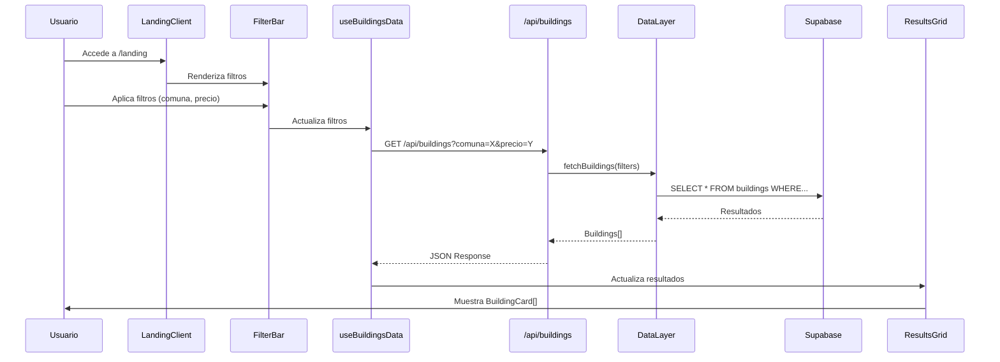
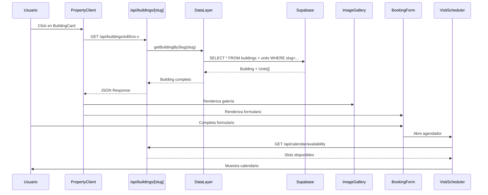
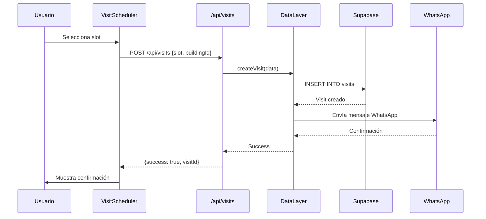

# 🏗️ ARQUITECTURA VISUAL - HOMMIE 0% COMISIÓN

**Última actualización:** 2025-01-27  
**Versión:** 1.0.0

---

## 📊 DIAGRAMA DE ARQUITECTURA COMPLETA

```mermaid
graph TB
    %% ============================================
    %% CAPA DE PRESENTACIÓN - USUARIO
    %% ============================================
    subgraph "👤 USUARIO"
        User[Usuario Final]
        Browser[🌐 Navegador]
        Mobile[📱 Dispositivo Móvil]
    end

    %% ============================================
    %% CAPA DE APLICACIÓN - FRONTEND
    %% ============================================
    subgraph "🎨 FRONTEND (Next.js 15.4.6 App Router)"
        subgraph "📄 PÁGINAS PRINCIPALES"
            HomePage["🏠 / (Home)"]
            LandingPage["🏢 /landing"]
            PropertyPage["🏘️ /property/[slug]"]
            ComingSoonPage["⏳ /coming-soon"]
            CotizadorPage["💰 /cotizador"]
            ArriendaPage["🏘️ /arrienda-sin-comision"]
            AdminPage["⚙️ /admin/flags"]
        end
        
        subgraph "🧩 COMPONENTES CLIENT"
            LandingClient[LandingClient.tsx]
            PropertyClient[PropertyClient.tsx]
            ComingSoonClient[ComingSoonClient.tsx]
            CotizadorClient[CotizadorClient.tsx]
        end
        
        subgraph "🎨 COMPONENTES UI"
            Filters[FilterBar.tsx<br/>AdvancedFilterBar.tsx]
            ResultsGrid[ResultsGrid.tsx<br/>VirtualResultsGrid.tsx]
            BuildingCard[BuildingCard.tsx<br/>BuildingCardV2.tsx]
            ImageGallery[ImageGallery.tsx]
            BookingForm[BookingForm.tsx]
            VisitScheduler[VisitScheduler.tsx<br/>QuintoAndarVisitScheduler.tsx]
            Calendar[WeekView.tsx<br/>SlotPicker.tsx]
        end
        
        subgraph "🎯 CUSTOM HOOKS"
            useBuildingsData[useBuildingsData.ts]
            useAdvancedFilters[useAdvancedFilters.ts]
            useBuildingsPagination[useBuildingsPagination.ts]
            useVirtualGrid[useVirtualGrid.ts]
            useVisitScheduler[useVisitScheduler.ts]
            usePropertyUnit[usePropertyUnit.ts]
        end
        
        subgraph "🗃️ ESTADO GLOBAL"
            BuildingsStore[buildingsStore.ts<br/>Zustand]
            ReactQuery[TanStack Query<br/>Cache & Sync]
        end
    end

    %% ============================================
    %% CAPA DE API - BACKEND
    %% ============================================
    subgraph "🔧 BACKEND (API Routes)"
        subgraph "🏢 BUILDINGS API"
            BuildingsAPI["/api/buildings<br/>GET: Lista edificios"]
            BuildingSlugAPI["/api/buildings/[slug]<br/>GET: Detalle por slug"]
            BuildingsPaginatedAPI["/api/buildings/paginated<br/>GET: Paginación"]
        end
        
        subgraph "📅 BOOKING & VISITS API"
            BookingAPI["/api/booking<br/>POST: Crear reserva"]
            VisitsAPI["/api/visits<br/>GET/POST: Gestión visitas"]
            AvailabilityAPI["/api/availability<br/>GET: Disponibilidad"]
            CalendarAPI["/api/calendar/availability<br/>GET: Slots calendario"]
        end
        
        subgraph "💰 QUOTATIONS API"
            QuotationsAPI["/api/quotations<br/>POST: Generar cotización"]
        end
        
        subgraph "📋 WAITLIST API"
            WaitlistAPI["/api/waitlist<br/>POST: Suscripción"]
        end
        
        subgraph "🎛️ ADMIN & DEBUG API"
            FlagsAPI["/api/flags/override<br/>POST: Override flags"]
            CompletenessAPI["/api/admin/completeness<br/>GET: Métricas"]
            DebugAPI["/api/debug-admin<br/>GET: Debug info"]
            AnalyticsAPI["/api/analytics/*<br/>POST: Tracking"]
        end
        
        subgraph "🔒 SEGURIDAD"
            RateLimit["Rate Limiting<br/>20 req/60s por IP"]
            ZodValidation["Validación Zod<br/>Server-side"]
        end
    end

    %% ============================================
    %% CAPA DE DATOS - DATA LAYER
    %% ============================================
    subgraph "🗄️ DATA LAYER"
        subgraph "📊 SUPABASE CLIENT"
            SupabaseClient[lib/supabase.ts<br/>Cliente configurado]
        end
        
        subgraph "🔄 DATA ADAPTERS"
            DataLayer[lib/data.ts<br/>Data Access Layer]
            DeriveLayer[lib/derive.ts<br/>Cálculos de negocio]
            MappingV2[lib/mapping-v2.ts<br/>Transformación datos]
            AssetplanAdapter[lib/adapters/assetplan.ts<br/>Adapter CSV]
        end
        
        subgraph "📋 SCHEMAS & TYPES"
            ZodSchemas[schemas/*.ts<br/>Validación Zod]
            TypeScriptTypes[types/*.ts<br/>TypeScript Types]
        end
        
        subgraph "🎛️ FEATURE FLAGS"
            FlagsSystem[lib/flags.ts<br/>Sistema de flags]
            FeatureFlagsJSON[config/feature-flags.json<br/>Configuración]
        end
    end

    %% ============================================
    %% CAPA DE PERSISTENCIA - DATABASE
    %% ============================================
    subgraph "💾 DATABASE (Supabase PostgreSQL)"
        subgraph "📊 TABLAS PRINCIPALES"
            BuildingsTable[(buildings<br/>Edificios)]
            UnitsTable[(units<br/>Unidades)]
            WaitlistTable[(waitlist<br/>Suscripciones)]
            BookingsTable[(bookings<br/>Reservas)]
            VisitsTable[(visits<br/>Visitas)]
            LeadsTable[(leads<br/>Leads)]
        end
        
        subgraph "📈 VISTAS & MATERIALIZED VIEWS"
            FiltersView[v_filters_available<br/>Filtros disponibles]
            PriceDropsView[mv_price_drops_7d<br/>Caídas de precio]
            NewListingsView[mv_new_listings_24h<br/>Nuevas altas]
            SnapshotsView[units_snapshot_daily<br/>Snapshots diarios]
        end
        
        subgraph "🔄 FUNCIONES & TRIGGERS"
            RefreshFunctions[refresh_building_aggregates<br/>take_daily_snapshots]
            HistoryTriggers[units_history<br/>Auditoría cambios]
        end
    end

    %% ============================================
    %% SERVICIOS EXTERNOS
    %% ============================================
    subgraph "🌐 EXTERNAL SERVICES"
        WhatsApp[📱 WhatsApp API<br/>Mensajería]
        Resend[📧 Resend<br/>Emails transaccionales]
        Analytics[📈 Analytics<br/>Google Analytics]
    end

    %% ============================================
    %% FLUJOS DE NAVEGACIÓN
    %% ============================================
    User --> Browser
    Browser --> HomePage
    HomePage --> LandingPage
    Browser --> PropertyPage
    Browser --> ComingSoonPage
    Browser --> CotizadorPage

    %% ============================================
    %% FLUJOS DE COMPONENTES
    %% ============================================
    LandingPage --> LandingClient
    PropertyPage --> PropertyClient
    ComingSoonPage --> ComingSoonClient
    CotizadorPage --> CotizadorClient

    LandingClient --> Filters
    LandingClient --> ResultsGrid
    ResultsGrid --> BuildingCard

    PropertyClient --> ImageGallery
    PropertyClient --> BookingForm
    PropertyClient --> VisitScheduler
    VisitScheduler --> Calendar

    %% ============================================
    %% FLUJOS DE HOOKS
    %% ============================================
    LandingClient --> useBuildingsData
    LandingClient --> useAdvancedFilters
    LandingClient --> useBuildingsPagination
    ResultsGrid --> useVirtualGrid

    PropertyClient --> usePropertyUnit
    VisitScheduler --> useVisitScheduler

    useBuildingsData --> BuildingsStore
    useBuildingsData --> ReactQuery

    %% ============================================
    %% FLUJOS DE API
    %% ============================================
    LandingClient --> BuildingsAPI
    PropertyClient --> BuildingSlugAPI
    ResultsGrid --> BuildingsPaginatedAPI
    BookingForm --> BookingAPI
    VisitScheduler --> VisitsAPI
    VisitScheduler --> CalendarAPI
    ComingSoonClient --> WaitlistAPI
    CotizadorClient --> QuotationsAPI

    %% ============================================
    %% FLUJOS DE VALIDACIÓN
    %% ============================================
    BuildingsAPI --> RateLimit
    BookingAPI --> RateLimit
    WaitlistAPI --> RateLimit
    
    BuildingsAPI --> ZodValidation
    BookingAPI --> ZodValidation
    WaitlistAPI --> ZodValidation

    %% ============================================
    %% FLUJOS DE DATOS
    %% ============================================
    BuildingsAPI --> DataLayer
    BuildingSlugAPI --> DataLayer
    BookingAPI --> DataLayer
    VisitsAPI --> DataLayer
    WaitlistAPI --> DataLayer
    QuotationsAPI --> DataLayer

    DataLayer --> SupabaseClient
    DataLayer --> DeriveLayer
    DeriveLayer --> MappingV2
    MappingV2 --> AssetplanAdapter

    SupabaseClient --> BuildingsTable
    SupabaseClient --> UnitsTable
    SupabaseClient --> WaitlistTable
    SupabaseClient --> BookingsTable
    SupabaseClient --> VisitsTable

    %% ============================================
    %% FLUJOS DE FEATURE FLAGS
    %% ============================================
    LandingClient --> FlagsSystem
    PropertyClient --> FlagsSystem
    ComingSoonClient --> FlagsSystem
    FlagsSystem --> FeatureFlagsJSON

    %% ============================================
    %% FLUJOS EXTERNOS
    %% ============================================
    BookingForm --> WhatsApp
    WaitlistAPI --> Resend
    LandingClient --> Analytics
    PropertyClient --> Analytics

    %% ============================================
    %% ESTILOS
    %% ============================================
    classDef userLayer fill:#e3f2fd,stroke:#1976d2,stroke-width:3px
    classDef frontendLayer fill:#f3e5f5,stroke:#7b1fa2,stroke-width:2px
    classDef apiLayer fill:#fff3e0,stroke:#e65100,stroke-width:2px
    classDef dataLayer fill:#e8f5e9,stroke:#388e3c,stroke-width:2px
    classDef dbLayer fill:#fce4ec,stroke:#c2185b,stroke-width:2px
    classDef externalLayer fill:#f1f8e9,stroke:#558b2f,stroke-width:2px

    class User,Browser,Mobile userLayer
    class LandingPage,PropertyPage,LandingClient,PropertyClient,ResultsGrid,BuildingCard frontendLayer
    class BuildingsAPI,BuildingSlugAPI,BookingAPI,WaitlistAPI,RateLimit apiLayer
    class DataLayer,DeriveLayer,MappingV2,SupabaseClient dataLayer
    class BuildingsTable,UnitsTable,WaitlistTable dbLayer
    class WhatsApp,Resend,Analytics externalLayer
```



---

## 🔄 FLUJO DE DATOS DETALLADO

### **1. Flujo de Búsqueda y Filtrado**



### **2. Flujo de Detalle de Propiedad**



### **3. Flujo de Agendamiento de Visita**



---

## 📁 ESTRUCTURA DE DIRECTORIOS VISUAL

```
hommie-0-commission-next/
│
├── 🎨 app/                          # Next.js App Router
│   ├── (catalog)/                   # Grupo de rutas: catálogo
│   │   └── property/[slug]/         # Páginas de detalle
│   │       ├── page.tsx             # RSC Server Component
│   │       └── PropertyClient.tsx  # Client Component
│   │
│   ├── (marketing)/                 # Grupo de rutas: marketing
│   │   ├── landing-v2/             # Landing page
│   │   └── flash-videos/           # Página promocional
│   │
│   ├── api/                         # API Routes (Backend)
│   │   ├── buildings/              # 🏢 CRUD edificios
│   │   │   ├── route.ts            # GET /api/buildings
│   │   │   ├── [slug]/route.ts     # GET /api/buildings/:slug
│   │   │   └── paginated/route.ts  # GET /api/buildings/paginated
│   │   │
│   │   ├── booking/                # 📅 Reservas
│   │   ├── visits/                 # 🗓️ Visitas
│   │   ├── quotations/              # 💰 Cotizaciones
│   │   ├── waitlist/                # 📋 Lista espera
│   │   └── admin/                  # ⚙️ Admin
│   │
│   ├── coming-soon/                 # ⏳ Coming soon
│   ├── cotizador/                   # 💰 Cotizador
│   └── admin/                       # ⚙️ Admin panel
│
├── 🧩 components/                    # Componentes React
│   ├── marketing/                   # Componentes marketing
│   │   ├── LandingClient.tsx
│   │   ├── ComingSoonClient.tsx
│   │   └── ...
│   │
│   ├── property/                    # Componentes propiedad
│   │   ├── PropertyClient.tsx
│   │   ├── ImageGallery.tsx
│   │   └── ...
│   │
│   ├── filters/                     # 🎯 Filtros
│   │   ├── FilterBar.tsx
│   │   ├── AdvancedFilterBar.tsx
│   │   └── ...
│   │
│   ├── lists/                       # 📋 Listas
│   │   ├── ResultsGrid.tsx
│   │   ├── VirtualResultsGrid.tsx
│   │   └── ...
│   │
│   ├── calendar/                    # 📅 Calendario
│   │   ├── WeekView.tsx
│   │   ├── SlotPicker.tsx
│   │   └── ...
│   │
│   ├── flow/                        # 🔄 Flujos
│   │   ├── VisitScheduler.tsx
│   │   └── ...
│   │
│   └── ui/                          # 🎨 UI Base
│       └── ...
│
├── 🎯 hooks/                         # Custom Hooks
│   ├── useBuildingsData.ts         # Data fetching
│   ├── useAdvancedFilters.ts        # Filtros avanzados
│   ├── useBuildingsPagination.ts    # Paginación
│   ├── useVirtualGrid.ts           # Virtualización
│   └── useVisitScheduler.ts        # Agendamiento
│
├── 🗃️ stores/                        # Estado Global
│   └── buildingsStore.ts           # Zustand Store
│
├── 📚 lib/                           # Utilidades
│   ├── data.ts                      # Data Access Layer
│   ├── supabase.ts                  # Cliente Supabase
│   ├── derive.ts                    # Cálculos negocio
│   ├── mapping-v2.ts                # Transformación datos
│   ├── flags.ts                     # Feature Flags
│   └── adapters/                    # Adapters
│       └── assetplan.ts            # CSV → Supabase
│
├── 📋 schemas/                       # Validación
│   ├── models.ts                    # Zod Schemas
│   └── quotation.ts                 # Schema cotizaciones
│
├── 📝 types/                         # TypeScript
│   └── index.ts                     # Types globales
│
├── ⚙️ config/                        # Configuración
│   ├── feature-flags.json          # Feature flags
│   └── ingesta.config.js            # Config ingesta
│
└── 📊 scripts/                       # Scripts
    ├── ingest-master.mjs            # Ingesta CSV
    └── ...
```

---

## 🎯 CAPAS DE ARQUITECTURA

### **Capa 1: Presentación (UI Layer)**
```
┌─────────────────────────────────────┐
│  🎨 COMPONENTES UI                   │
│  - LandingClient                     │
│  - PropertyClient                    │
│  - FilterBar, ResultsGrid           │
│  - BuildingCard, ImageGallery        │
└─────────────────────────────────────┘
           ↓ ↑
┌─────────────────────────────────────┐
│  🎯 HOOKS & ESTADO                   │
│  - useBuildingsData                 │
│  - useAdvancedFilters                │
│  - Zustand Store                    │
│  - React Query Cache                │
└─────────────────────────────────────┘
```

### **Capa 2: API (Backend Layer)**
```
┌─────────────────────────────────────┐
│  🔧 API ROUTES                       │
│  - /api/buildings                   │
│  - /api/booking                      │
│  - /api/visits                       │
│  - /api/waitlist                     │
└─────────────────────────────────────┘
           ↓ ↑
┌─────────────────────────────────────┐
│  🔒 SEGURIDAD                        │
│  - Rate Limiting (20/60s)           │
│  - Zod Validation                   │
│  - Error Handling                   │
└─────────────────────────────────────┘
```

### **Capa 3: Datos (Data Layer)**
```
┌─────────────────────────────────────┐
│  🔄 DATA ADAPTERS                    │
│  - data.ts (DAL)                    │
│  - derive.ts (Cálculos)            │
│  - mapping-v2.ts (Transformación)  │
└─────────────────────────────────────┘
           ↓ ↑
┌─────────────────────────────────────┐
│  📊 SUPABASE CLIENT                  │
│  - Cliente configurado              │
│  - Queries optimizadas              │
│  - Connection pooling               │
└─────────────────────────────────────┘
```

### **Capa 4: Persistencia (Database)**
```
┌─────────────────────────────────────┐
│  💾 POSTGRESQL (Supabase)            │
│  - buildings, units                 │
│  - waitlist, bookings, visits       │
│  - Materialized Views               │
│  - Functions & Triggers              │
└─────────────────────────────────────┘
```

---

## 🔄 PATRONES ARQUITECTÓNICOS

### **1. Server Components First (RSC)**
```typescript
// ✅ CORRECTO: RSC por defecto
// app/property/[slug]/page.tsx
export default async function PropertyPage({ params }) {
  const building = await getBuildingBySlug(params.slug);
  return <PropertyClient building={building} />;
}

// ✅ Client Component solo cuando necesario
// app/property/[slug]/PropertyClient.tsx
'use client';
export function PropertyClient({ building }) {
  // Estado, efectos, interactividad
}
```

### **2. Data Access Layer (DAL)**
```typescript
// lib/data.ts - Única fuente de verdad
export async function fetchBuildings(filters) {
  // Lógica de negocio centralizada
  // Manejo de errores
  // Transformación de datos
  return buildings;
}
```

### **3. Feature Flags**
```typescript
// lib/flags.ts
export function isFeatureEnabled(feature: string): boolean {
  // Lee config/feature-flags.json
  // Permite rollouts graduales
}
```

### **4. Validación con Zod**
```typescript
// schemas/models.ts
const BuildingSchema = z.object({
  id: z.string(),
  name: z.string().min(1),
  // ...
});

// API Route
export async function POST(request: Request) {
  const body = await request.json();
  const validated = BuildingSchema.parse(body); // ✅ Validación
}
```

---

## 📊 MÉTRICAS DE ARQUITECTURA

| Métrica | Valor | Estado |
|---------|-------|--------|
| **Componentes React** | 100+ | 🟢 |
| **API Routes** | 22 | 🟢 |
| **Custom Hooks** | 10+ | 🟢 |
| **Zod Schemas** | 4 | 🟢 |
| **Feature Flags** | 3 | 🟢 |
| **Tablas Supabase** | 6+ | 🟢 |
| **Materialized Views** | 4 | 🟢 |

---

## 🚀 PRÓXIMOS PASOS ARQUITECTÓNICOS

1. **Virtual Grid** - Implementar virtualización para listas grandes
2. **React Query** - Migrar completamente a TanStack Query
3. **ISR** - Implementar Incremental Static Regeneration
4. **Error Boundaries** - Mejorar manejo de errores
5. **Performance Monitoring** - Implementar métricas en tiempo real

---

**📋 Documentación relacionada:**
- `docs/ARQUITECTURA.md` - Arquitectura detallada
- `docs/ARQUITECTURA_RESUMEN_EJECUTIVO.md` - Resumen ejecutivo
- `REPORTE_ARQUITECTURA_DATOS_PARA_COTIZACIONES.md` - Arquitectura de datos

